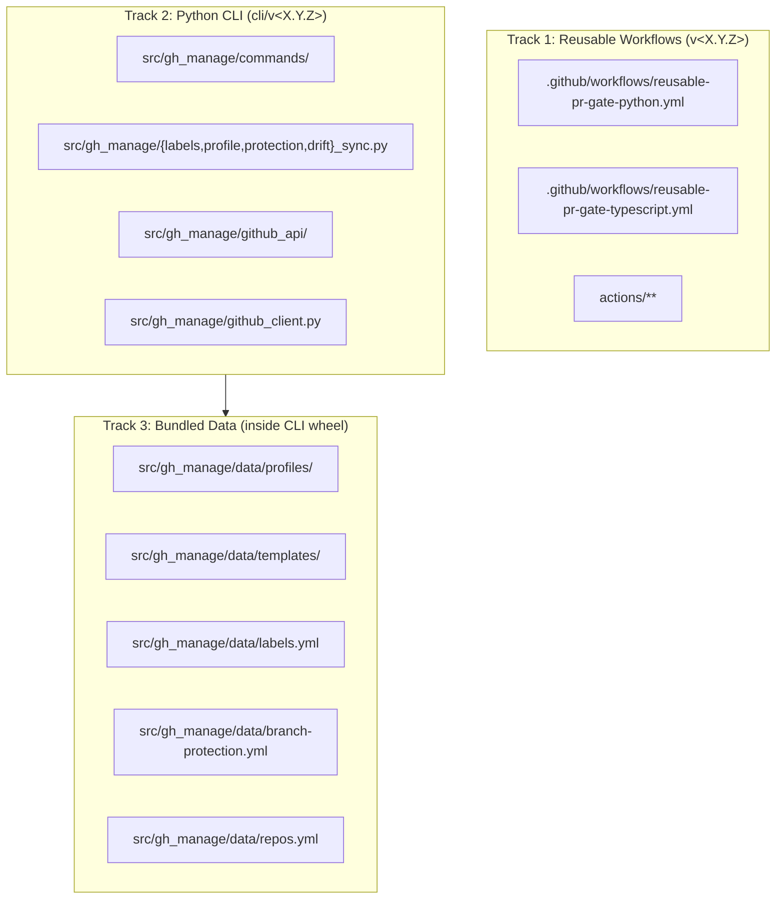

# Architecture

gh-manage is a focused operational tool for managing GitHub CI/CD, labels, branch protection, and drift across a single organization (`yakkuro`). This document explains what it is composed of and why.

If you only want to use gh-manage, read [`quick-start.md`](quick-start.md) first and skip this document until you need to contribute or debug.

## Three-track deliverable model

gh-manage ships three independent deliverables, each with its own distribution channel and version track:



The three tracks share a single Git repository but carry independent Git tags. See [`versioning.md`](versioning.md) for the full two-track tagging policy.

## Track 1: Reusable GitHub Actions workflows

- `.github/workflows/reusable-pr-gate-python.yml` — Python PR gate (install → ruff → mypy → pytest).
- `.github/workflows/reusable-pr-gate-typescript.yml` — TypeScript PR gate (pnpm install → eslint → tsc → vitest).
- `actions/**` — 7 composite actions: `log-gh-manage-version`, `setup-python-uv`, `run-ruff`, `run-mypy`, `setup-node-pnpm`, `run-eslint`, `run-tsc`.

### The self-checkout pattern

Reusable workflows in GitHub Actions resolve relative-path references (`./actions/<name>`) against the runner's workspace, which after `actions/checkout` contains the **caller's** repository, not gh-manage's. To make composite actions reachable cross-repo, every reusable workflow opens with a second `actions/checkout` step that fetches `yakkuro/gh-manage` at the same `@<ref>` the consumer used, into `.gh-manage/`. Subsequent steps reference the composites via `./.gh-manage/actions/<name>`.

### Why `gh-manage-ref` is a required input

Consumers must explicitly pass the same `@<ref>` they used in the `uses:` line to a required `gh-manage-ref` input. Duplication is unavoidable because GitHub Actions does not expose the called workflow's own ref via any built-in context variable (`github.workflow_ref` returns the top-level caller's ref, not the called workflow's ref — this was a v0.2.1 CRITICAL fix). See `CHANGELOG-reusable.md` v0.2.1 for the full incident record.

### Pinned tool versions

Reusable workflows pin the tools they invoke at gh-manage level, not consumer level, so consumers do not need to pick versions:

| Tool | Pinned version |
|---|---|
| `uv` | `0.5.0` |
| `ruff` | `0.8.0` |
| `mypy` | `1.12.0` |
| `pnpm` | `10.33.0` |
| `typescript` | `6.0.2` |

Changing any of these is a v1.0 contract surface; see [`versioning.md`](versioning.md) for the upgrade protocol.

### Smoke test

`.github/workflows/smoke-test.yml` runs on every PR that touches the reusables or composite actions. It exercises 6 fixture projects under `tests/fixtures/projects/`: `python-sample` (positive), `python-lint-fail` (expect ruff F401), `python-test-fail` (expect pytest assertion failure), `typescript-sample` (positive), `typescript-lint-fail` (expect eslint `no-unused-vars`), `typescript-type-fail` (expect tsc `TS2322`). Each negative fixture verifies both the outcome (`failure`) AND the direct tool output (grep for the specific rule/error code), so a broken composite does not masquerade as a "working" negative fixture.

## Track 2: Python CLI

The CLI is organized in 3 layers and two load-bearing constraints hold the pattern together.

```
┌─────────────────────────────────────────────┐
│ Layer 1: commands/*.py                      │  click subcommands, user-facing errors
│   labels.py, init.py, apply.py, protection  │  Handles argv parsing and error rendering.
│   drift.py, issues.py                       │  Delegates to engine modules.
└──────────────────┬──────────────────────────┘
                   ▼
┌─────────────────────────────────────────────┐
│ Layer 2: {labels,profile,protection,drift}  │  Pure-function engines.
│   _sync.py                                  │  Dataclasses + compute_* / apply_* functions.
│   Knows NOTHING about subprocess / git /    │  Testable without mocking subprocess.
│   the GitHub API.                           │
└──────────────────┬──────────────────────────┘
                   ▼
┌─────────────────────────────────────────────┐
│ Layer 3: github_api/*.py + github_client.py │  Resource wrappers around `gh api`.
│   labels.py, protection.py, issues.py,      │  ALL gh api calls go through github_client.
│   repo_info.py                              │  Subprocess transport + 6-subclass GhError.
└─────────────────────────────────────────────┘
```

### Load-bearing constraints

1. **All `gh api` calls go through `src/gh_manage/github_client.py`.** No other module in `src/gh_manage/` may call `subprocess.run` against `gh`. This gives a single chokepoint for error classification (the 6-subclass `GhError` hierarchy), rate-limit handling, and retries.
2. **Engine modules (`{labels,profile,protection,drift}_sync.py`) know nothing about subprocess / git / the GitHub API.** They accept plain data inputs (parsed YAML models, `pathlib.Path` objects, already-fetched API responses) and return plain data outputs (frozen dataclasses). This lets engine tests run without mocking `subprocess`, and makes future alternative transports trivial.

### Inventory of engine modules

- `labels_sync.py` — `compute_diff`, `apply_diff`, `LabelsDiff`. Rename detection via explicit `old_name` field. Fail-fast order: renames → creates → updates → deletes.
- `profile_sync.py` — `compute_files_diff`, `apply_files_diff`, `ProfileFilesDiff`. Raw byte copy with path-traversal defense (pydantic pre-filter + `Path.resolve()` + `is_relative_to()`).
- `protection_sync.py` — `compute_protection_diff`, `apply_protection_diff`, `detect_downgrade`, `ProtectionDiff`. 13 downgrade-detection rules; transactional apply with microsecond-precision backup filenames.
- `drift_sync.py` — `run_all_checks`, `check_labels`, `check_protection`, `check_profile_files`, `Finding`, `ScanContext`. Check-registry pattern with `@register_check` decorator. Produces stdout / JSON / Markdown / GitHub Issue reports.

## Track 3: Bundled data

`src/gh_manage/data/` contains all configuration and templates that ship with the CLI:

| Path | Purpose |
|---|---|
| `data/labels.yml` | Default label definitions (8 type + 6 meta labels) |
| `data/branch-protection.yml` | Branch protection policies (currently `solo-default` only) |
| `data/repos.yml` | `owner/repo → profile` mapping for the `--all` scanner flag |
| `data/profiles/python-service.yml` | First profile: file placement + protection policy reference |
| `data/templates/ci/python-ci.yml` | Minimal consumer CI workflow (used by `python-service` profile) |
| `data/templates/claude-md/default.md` | CLAUDE.md template (rendered via `python-service` profile, `skip_if_exists: true`) |

The profile system points at template files: a profile YAML lists `{source, dest}` pairs, and the profile engine resolves `source` paths against `data/templates/` at `compute_files_diff` time. This indirection lets a single profile compose templates from multiple categories without tangling template content with profile-spec structure.

At runtime, `importlib.resources.files("gh_manage.data.<subpkg>")` resolves these paths regardless of whether the CLI is running from an editable install (`pip install -e .`) or a wheel install (`uv tool install git+...`). The Phase 9 L6 characterization test (`test_bundled_python_service_package_data_resolves_and_applies`) pins this resolution path.

## Testing layers (L1–L7)

| Layer | Scope | Target | Status |
|---|---|---|---|
| L1 | `scripts/checks/*.sh` shell scripts | 80% | Not built (no shell scripts in v1.0) |
| L2 | `actions/*/action.yml` composite actions | smoke workflow binary | Covered by `smoke-test.yml` |
| L3 | `.github/workflows/reusable-*.yml` | smoke workflow binary | Covered by `smoke-test.yml` |
| L4 | `src/gh_manage/` Python CLI | 85% | **94% at v1.0.0** |
| L5 | `src/gh_manage/commands/drift.py` | 90% | **93% at v1.0.0** |
| L6 | `src/gh_manage/data/templates/` | 100% golden file | Phase 9 characterization test |
| L7 | Real API integration against fixture repo | pre-release manual | Deferred to v1.1+ (9-repo Phase C production dogfood run used as equivalent validation for v1.0) |

## What is NOT in gh-manage

These belong elsewhere or are explicitly deferred. Adding any of them requires updating the top-level design spec:

- **Claude runtime workflows** (subagents, skills, hooks) — live in `~/repos/claude-dotfiles`, not here
- **Cross-repo dashboard UI** — domain F, deferred
- **Release management for other repos** — domain G, deferred
- **Dependency management / Dependabot distribution** — domain H, deferred
- **GitHub Enterprise support** — out of scope (yakkuro org only)
- **PyPI publishing** — deferred until post-v1.0 (see [`distribution-channels.md`](distribution-channels.md))
- **`act` / nektos local Actions execution** — out of scope

## Reference

- Top-level design specification: [`specs/2026-04-10-gh-manage-design.md`](specs/2026-04-10-gh-manage-design.md) — the authoritative document this architecture summary is derived from.
- Versioning policy: [`versioning.md`](versioning.md)
- Distribution channels: [`distribution-channels.md`](distribution-channels.md)
