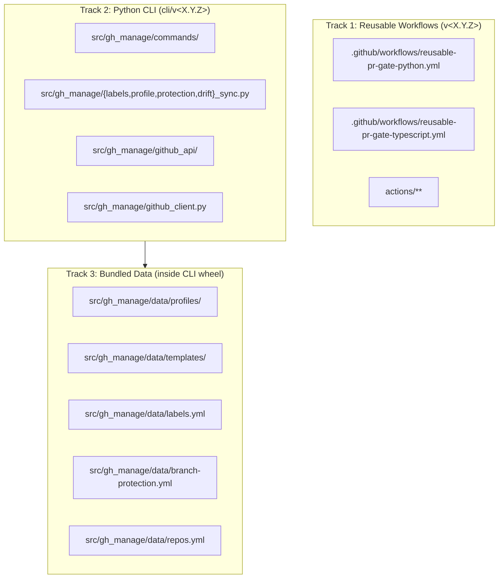

# Phase 9 — v1.0 Hardening Implementation Plan

> **For agentic workers:** REQUIRED SUB-SKILL: Use superpowers:subagent-driven-development to implement this plan task-by-task. Steps use checkbox (`- [ ]`) syntax for tracking.

**Goal:** Close the remaining Phase 9 acceptance-criteria gaps (L6 characterization test, 5 documentation files, consumers.md Phase C section, 2 CHANGELOG updates) in a single feature PR, then graduate `yakkuro/gh-manage` to v1.0.0 via a separate bump PR that ends with `v1.0.0` and `cli/v1.0.0` tags on the same commit.

**Architecture:** Two-PR release flow. Feature PR (~900 content LOC across 11 files) adds one characterization test, replaces a 23-line README stub with a 3-track tour, and creates 4 new docs files + a Phase C consumers section + 4 CHANGELOG-cli entries + a v1.0.0 CHANGELOG-reusable stability entry. No production-code changes to `src/gh_manage/`. Bump PR (~12 LOC across 6 files) updates `pyproject.toml`, `src/gh_manage/__init__.py`, `tests/test_sanity.py`, renames `[Unreleased]` → `[1.0.0]` in both CHANGELOGs, and regenerates `uv.lock`. After bump PR merges, the release flow pushes `v1.0.0` + `cli/v1.0.0` tags and creates both GitHub releases.

**Tech Stack:** Python 3.12 / uv / click 8.x / pydantic v2 / pytest 8 / pytest-cov / ruff / mypy / `gh` CLI for all GitHub API operations.

**Spec reference:** `docs/specs/2026-04-14-phase-9-v1-hardening-design.md`

---

## Implementation-Time Data (resolved at plan authoring time)

All placeholder data from the spec's "Implementation-Time Placeholders" section has been resolved below. Tasks reference this data directly.

### CHANGELOG-cli entries — PR numbers and merge dates

Resolved via `gh pr list --state merged --search "Phase 6 OR Phase 7 OR Phase 8" --json number,title,mergedAt`:

| Entry | Phase | PR # | Merge date (UTC) | Plan file |
|---|---|---|---|---|
| `[0.3.0] - 2026-04-11` | Phase 6 init + apply | #12 | 2026-04-11 12:01 | `docs/plans/2026-04-11-phase-6-init-apply.md` |
| `[0.4.0] - 2026-04-11` | Phase 7 branch protection | #16 | 2026-04-11 14:53 | `docs/plans/2026-04-11-phase-7-protection.md` |
| `[0.5.0] - 2026-04-12` | Phase 8 drift scanner | #18 | 2026-04-12 03:28 | `docs/plans/2026-04-11-phase-8-drift.md` |
| `[0.6.0] - 2026-04-12` | Phase 8.5 drift automation | #21 | 2026-04-12 04:45 | `docs/plans/2026-04-12-phase-8.5-drift-automation.md` |

Keep-a-Changelog convention: use the PR merge date (`mergedAt` field), not the phase authoring date.

### Phase C Drift-scanner production-validation threshold

Resolved via `gh run list --workflow=drift-scanner.yml --json createdAt,status --limit 20`:

- **Cron runs completed** (scheduled from `0 0 * * 1`): 1 (earliest: 2026-04-13 01:57 UTC)
- **Clock-time exposure** at plan authoring (2026-04-14 09:46 UTC): 31.8 hours
- **Threshold status**: does NOT yet meet the spec's `≥ 1 scheduled cron AND ≥ 48h clock time` minimum

**Decision for plan execution**: the feature PR writes the consumers.md Phase C section with the table + "What Phase C validated" subsection but **omits the "Discoveries" paragraph entirely** until the threshold is met. At pre-merge verification (Task 12), re-check the threshold; if met, add the Discoveries paragraph as a final feature-PR commit. If still not met, defer the Discoveries paragraph to the bump PR, which will definitely clear 48h by the time it merges.

### Phase C domain column values

Resolved via `gh repo view yakkuro/<name> --json description`. Both `nade-nade` and `picshop` have empty descriptions. Tasks use placeholder "(description TBD)" with a note to check README at execution time.

---

## File Structure

This plan touches 11 content files + 1 plan file + 1 test file. Content files are editorial (markdown) and do not affect the module graph.

| File | Action | Responsibility |
|---|---|---|
| `tests/unit/profile_sync/test_golden.py` | append 1 test function | L6 bundled-templates characterization test |
| `README.md` | replace | Top-of-repo "Three tracks" tour |
| `docs/architecture.md` | new | 3-track deliverable model + CLI 3-layer architecture explanation |
| `docs/quick-start.md` | new | 15-minute onboarding walkthrough for yakkuro org members |
| `docs/versioning.md` | new | Semver policy + stability promise + pinning recommendations |
| `docs/distribution-channels.md` | new | Git tags as distribution channel + why-not-PyPI rationale |
| `docs/consumers.md` | append | Phase C bulk rollout section after llm-kb narrative |
| `CHANGELOG-cli.md` | append `[Unreleased]` | 4 new entries for 0.3.0 / 0.4.0 / 0.5.0 / 0.6.0 |
| `CHANGELOG-reusable.md` | append `[Unreleased]` | 1 new v1.0.0 stability entry |
| `docs/release-checklist.md` | 1-line note | L7 deferral recording |
| `docs/plans/2026-04-14-phase-9-v1-hardening.md` | new (this file) | Plan document itself |

After the feature PR merges, the bump PR touches 6 more files: `pyproject.toml`, `src/gh_manage/__init__.py`, `tests/test_sanity.py`, `CHANGELOG-cli.md` (rename `[Unreleased]` → `[1.0.0]`), `CHANGELOG-reusable.md` (same), `uv.lock` (auto-regenerated).

---

## Task-by-Task Implementation

### Task 1: L6 bundled templates characterization test

**Files:**
- Test: `tests/unit/profile_sync/test_golden.py` (append to existing file)

This is a **characterization test** (regression pin), NOT classic TDD. The raw-byte-copy invariant in `profile_sync._safe_write` already exists and produces byte-identical copies. The test's purpose is to pin the current correct behavior against future mutations.

**Context you need:**
- `src/gh_manage/profile_sync.py` implements `compute_files_diff` (pure, returns `ProfileFilesDiff`) and `apply_files_diff` (executes the diff). Neither does any substitution.
- `src/gh_manage/data/profiles/python-service.yml` lists 2 file entries: `ci/python-ci.yml → .github/workflows/ci.yml` and `claude-md/default.md → CLAUDE.md` (with `skip_if_exists: true`).
- `src/gh_manage/data/templates/ci/python-ci.yml` is 20 lines of plain static YAML.
- `src/gh_manage/data/templates/claude-md/default.md` is 24 lines of plain static Markdown.
- `importlib.resources.files()` returns a `MultiplexedPath` that must be converted via `Path(str(...))` to satisfy `load_config()` and `compute_files_diff()` which want real `pathlib.Path`.

- [ ] **Step 1: Add the new import at the top of `tests/unit/profile_sync/test_golden.py`**

Open `tests/unit/profile_sync/test_golden.py`. After the existing `from gh_manage.profile_sync import apply_files_diff, compute_files_diff` line, add:

```python
from importlib.resources import files
```

- [ ] **Step 2: Append the new characterization test function at the end of `tests/unit/profile_sync/test_golden.py`**

Append this function at the end of the file:

```python
def test_bundled_python_service_package_data_resolves_and_applies(
    tmp_path: Path,
) -> None:
    """L6 characterization test per Phase 0 design spec.

    Purpose: pin the raw-byte-copy behavior of apply_files_diff when it
    resolves bundled profile + templates via importlib.resources. Unique
    value is proving package-data resolution works for wheel installs;
    the byte-compare is a side effect of profile_sync's raw-copy
    invariant. See docs/specs/2026-04-14-phase-9-v1-hardening-design.md
    section 1 for the regression-check procedure and future-evolution
    note.
    """
    profiles_root = files("gh_manage.data.profiles")
    templates_root_ref = files("gh_manage.data.templates")

    profile_path = Path(str(profiles_root / "python-service.yml"))
    profile = load_config(profile_path, ProfileSpec)

    templates_root = Path(str(templates_root_ref))

    diff = compute_files_diff(profile, tmp_path, templates_root)
    assert len(diff.creates) == 2
    assert diff.overwrites == ()
    assert diff.skipped == ()
    assert diff.noops == ()

    apply_files_diff(diff, tmp_path, templates_root)

    for entry in profile.files:
        written = tmp_path / entry.dest
        source = templates_root / entry.source
        assert written.read_bytes() == source.read_bytes(), (
            f"Bundled template {entry.source} did not apply byte-identically "
            f"to {entry.dest}. If a placeholder-substitution feature was added "
            f"to profile_sync, delete this test and Phase 6 fixture golden "
            f"tests per the spec's Future Evolution note; do NOT mechanically "
            f"update the expected-bytes computation."
        )
```

- [ ] **Step 3: Run the new test — expect PASS on first run**

Run: `uv run pytest tests/unit/profile_sync/test_golden.py::test_bundled_python_service_package_data_resolves_and_applies -v`

Expected output contains:
```
tests/unit/profile_sync/test_golden.py::test_bundled_python_service_package_data_resolves_and_applies PASSED
```

The test PASSES on first run because the invariant already holds for bundled templates. This is correct characterization-test behavior; next step confirms the test detects breakage.

- [ ] **Step 4: Regression check — temporarily mutate `_safe_write` and confirm FAIL**

Open `src/gh_manage/profile_sync.py`. Find the `_safe_write` function (around line 251). Locate the line:

```python
dest.write_bytes(source.read_bytes())
```

Temporarily change it to:

```python
dest.write_bytes(b"X" + source.read_bytes())
```

Do NOT modify the function signature, imports, or any other structure. Only the one byte-copying line changes.

Run: `uv run pytest tests/unit/profile_sync/test_golden.py::test_bundled_python_service_package_data_resolves_and_applies -v`

Expected output contains:
```
tests/unit/profile_sync/test_golden.py::test_bundled_python_service_package_data_resolves_and_applies FAILED
```

AND the failure message contains text about bytes not matching and the actionable message from the assertion.

If the test does NOT fail, the characterization test is broken — stop and debug before proceeding.

- [ ] **Step 5: Revert the mutation and re-run — confirm PASS**

In `src/gh_manage/profile_sync.py`, revert the line back to:

```python
dest.write_bytes(source.read_bytes())
```

Run: `uv run pytest tests/unit/profile_sync/test_golden.py::test_bundled_python_service_package_data_resolves_and_applies -v`

Expected output contains:
```
tests/unit/profile_sync/test_golden.py::test_bundled_python_service_package_data_resolves_and_applies PASSED
```

This proves the test correctly distinguishes broken behavior from correct behavior.

- [ ] **Step 6: Run the full test suite to confirm no regressions**

Run: `uv run pytest`

Expected: **401 passed** (400 previous + 1 new). Nothing else should change.

- [ ] **Step 7: Commit**

```bash
git add tests/unit/profile_sync/test_golden.py
git commit -m "test: add L6 bundled-templates characterization test

Pins apply_files_diff's byte-identical copy behavior for the bundled
python-service profile, resolved via importlib.resources. This
complements the Phase 6 fixture golden tests by specifically exercising
package-data resolution (important for wheel installs).

Regression-verified by temporarily mutating _safe_write to prepend
b'X' (test FAILED as expected), then reverting (test PASSED).

Ref: docs/specs/2026-04-14-phase-9-v1-hardening-design.md section 1"
```

---

### Task 2: Replace `README.md` with the Three tracks tour

**Files:**
- Replace: `README.md` (currently 23 lines, target ~100 lines)

**Context you need:**
- The existing README is a 23-line stub ending with an MIT license line. The replacement must preserve MIT as the license.
- The "Three tracks" framing is critical — Q1 of brainstorming selected this over a flat "Features" bullet list. The spec addresses this in `spec-critique` Round 1 HIGH #1.
- Link targets: `docs/quick-start.md`, `docs/architecture.md`, `docs/versioning.md`, `docs/distribution-channels.md`, `docs/consumers.md`, `docs/release-checklist.md`, `docs/specs/2026-04-10-gh-manage-design.md`. Some of these don't exist yet at this task; they will be created in later tasks. That's fine — the links become valid once those tasks complete.
- Do not use emojis per user global rules.

- [ ] **Step 1: Overwrite `README.md` with the full 3-track tour**

Replace the entire contents of `README.md` with:

```markdown
# gh-manage

**Status:** v1.0 stable — reusable workflows and CLI are production-used across the `yakkuro` organization.

GitHub-based CI/CD, Issue management, and operational system for `yakkuro/*` repositories. `gh-manage` distributes reusable GitHub Actions workflows, composite actions, Issue/PR templates, label definitions, and branch protection policies across multiple repositories under a single declarative source.

## Three tracks

gh-manage ships three independent deliverables, each consumed in a different way. Reading them in order helps clarify what you are installing and why.

### 1. Reusable GitHub Actions workflows

- **Python PR gate** and **TypeScript PR gate** workflows that run `install → lint → type-check → setup → test` against consumer repos.
- Consumed via a `uses:` line in the consumer's `.github/workflows/ci.yml`:
  ```yaml
  uses: yakkuro/gh-manage/.github/workflows/reusable-pr-gate-python.yml@v1.0.0
  ```
- Versioned independently at `v<major>.<minor>.<patch>` (currently `v1.0.0`).
- No installation required on the consumer side beyond adding the `uses:` line and specifying the `gh-manage-ref` input.

### 2. Python CLI (`gh-manage`)

- A `click`-based CLI with 6 subcommands: `labels`, `init`, `apply`, `protection`, `drift`, `issues`.
- Consumed via `uv tool install`:
  ```bash
  uv tool install git+https://github.com/yakkuro/gh-manage@cli/v1.0.0
  ```
- Versioned independently at `cli/v<major>.<minor>.<patch>` (currently `cli/v1.0.0`).
- Requires `uv` and `gh` CLI on the user's machine.

### 3. Bundled configuration and templates

- Label definitions, branch protection policies, profile specifications, and file templates shipped inside the CLI wheel.
- Consumed transparently through CLI subcommands (never accessed directly); `importlib.resources` resolves package data from the installed wheel.
- Versioned together with the CLI (`cli/v<major>.<minor>.<patch>`).

## Quick example

Install the CLI:

```bash
uv tool install git+https://github.com/yakkuro/gh-manage@cli/v1.0.0
gh-manage --version
```

Bootstrap a Python repo:

```bash
cd path/to/your-repo
gh-manage init --profile python-service .
```

Add the reusable PR gate to `.github/workflows/ci.yml`:

```yaml
name: CI
on:
  pull_request:
    branches: [main]
jobs:
  pr-gate:
    uses: yakkuro/gh-manage/.github/workflows/reusable-pr-gate-python.yml@v1.0.0
    with:
      python-version: "3.12"
      gh-manage-ref: "v1.0.0"
```

## Getting started

Walk through [`docs/quick-start.md`](docs/quick-start.md) for a 15-minute onboarding from zero to green PR gate.

## Documentation

| Document | Purpose |
|---|---|
| [`docs/quick-start.md`](docs/quick-start.md) | 15-minute hands-on walkthrough |
| [`docs/architecture.md`](docs/architecture.md) | 3-track deliverable model + CLI 3-layer architecture |
| [`docs/versioning.md`](docs/versioning.md) | Semver policy, stability promise, pinning recommendations |
| [`docs/distribution-channels.md`](docs/distribution-channels.md) | Why Git tags, why not PyPI, install verification |
| [`docs/consumers.md`](docs/consumers.md) | Adoption examples and case studies |
| [`docs/release-checklist.md`](docs/release-checklist.md) | Pre-release / tagging / post-release procedures |
| [`docs/specs/2026-04-10-gh-manage-design.md`](docs/specs/2026-04-10-gh-manage-design.md) | Top-level design specification |
| [`CHANGELOG-reusable.md`](CHANGELOG-reusable.md) | Changelog for reusable workflows (`v<X.Y.Z>` tags) |
| [`CHANGELOG-cli.md`](CHANGELOG-cli.md) | Changelog for the Python CLI (`cli/v<X.Y.Z>` tags) |

## Scope boundaries

gh-manage is a focused operational tool, not a general-purpose platform. See the design spec's `## Non-Goals` section for the authoritative list. Not included: Claude runtime workflows, cross-repo dashboard UI, release management for other repos, Dependabot distribution, GitHub Enterprise support, PyPI publishing, `act`/nektos local execution.

## License

MIT. See [LICENSE](LICENSE).
```

- [ ] **Step 2: Verify LOC count is within 80 ≤ LOC ≤ 250**

Run: `wc -l README.md`

Expected: `100 ≤ LOC ≤ 130`. If outside the 80-250 range from the spec, adjust before committing.

- [ ] **Step 3: Commit**

```bash
git add README.md
git commit -m "docs: replace README stub with v1.0 three-tracks tour

Previous README was a 23-line stub. New README opens with the 'Three
tracks' framing so readers understand before the Quick Example that
gh-manage ships 3 independently-versioned deliverables: reusable
workflows, Python CLI, and bundled data. Documentation table links
to the 5 new Phase 9 docs (quick-start, architecture, versioning,
distribution-channels, and the existing release-checklist + consumers).

Ref: docs/specs/2026-04-14-phase-9-v1-hardening-design.md section 2.1"
```

---

### Task 3: Create `docs/architecture.md`

**Files:**
- Create: `docs/architecture.md` (target 150-200 lines)

**Context you need:**
- Mermaid diagram is fine — GitHub renders it. Use ```mermaid fenced block.
- The CLI 3-layer constraint ("all gh api calls go through github_client.py", "engine modules know nothing about subprocess/git/GitHub") is load-bearing; it's mentioned in the top-level design spec's Technical Decisions section and in `CLAUDE.md`. Preserve it verbatim.
- The "7 composite actions" count: `log-gh-manage-version`, `setup-python-uv`, `run-ruff`, `run-mypy`, `setup-node-pnpm`, `run-eslint`, `run-tsc` — that's 7.
- L1-L7 testing table comes from the top-level design spec section "Testing layers". Use the same rows.

- [ ] **Step 1: Create `docs/architecture.md` with the full content**

Create `docs/architecture.md` with:

```markdown
# Architecture

gh-manage is a focused operational tool for managing GitHub CI/CD, labels, branch protection, and drift across a single organization (`yakkuro`). This document explains what it is composed of and why.

If you only want to use gh-manage, read [`quick-start.md`](quick-start.md) first and skip this document until you need to contribute or debug.

## Three-track deliverable model

gh-manage ships three independent deliverables, each with its own distribution channel and version track:



The three tracks share a single Git repository but carry independent Git tags. See [`versioning.md`](versioning.md) for the full two-track tagging policy.

## Track 1: Reusable GitHub Actions workflows

- `.github/workflows/reusable-pr-gate-python.yml` — Python PR gate (install → ruff → mypy → pytest).
- `.github/workflows/reusable-pr-gate-typescript.yml` — TypeScript PR gate (pnpm install → eslint → tsc → vitest).
- `actions/**` — 7 composite actions: `log-gh-manage-version`, `setup-python-uv`, `run-ruff`, `run-mypy`, `setup-node-pnpm`, `run-eslint`, `run-tsc`.

### The self-checkout pattern

Reusable workflows in GitHub Actions resolve relative-path references (`./actions/<name>`) against the runner's workspace, which after `actions/checkout` contains the **caller's** repository, not gh-manage's. To make composite actions reachable cross-repo, every reusable workflow opens with a second `actions/checkout` step that fetches `yakkuro/gh-manage` at the same `@<ref>` the consumer used, into `.gh-manage/`. Subsequent steps reference the composites via `./.gh-manage/actions/<name>`.

### Why `gh-manage-ref` is a required input

Consumers must explicitly pass the same `@<ref>` they used in the `uses:` line to a required `gh-manage-ref` input. Duplication is unavoidable because GitHub Actions does not expose the called workflow's own ref via any built-in context variable (`github.workflow_ref` returns the top-level caller's ref, not the called workflow's ref — this was a v0.2.1 CRITICAL fix). See `CHANGELOG-reusable.md` v0.2.1 for the full incident record.

### Pinned tool versions

Reusable workflows pin the tools they invoke at gh-manage level, not consumer level, so consumers do not need to pick versions:

| Tool | Pinned version |
|---|---|
| `uv` | `0.5.0` |
| `ruff` | `0.8.0` |
| `mypy` | `1.12.0` |
| `pnpm` | `10.33.0` |
| `typescript` | `6.0.2` |

Changing any of these is a v1.0 contract surface; see [`versioning.md`](versioning.md) for the upgrade protocol.

### Smoke test

`.github/workflows/smoke-test.yml` runs on every PR that touches the reusables or composite actions. It exercises 5 fixture projects under `tests/fixtures/projects/`: `python-sample` (positive), `python-lint-fail` (expect ruff F401), `python-test-fail` (expect pytest assertion failure), `typescript-sample` (positive), `typescript-lint-fail` (expect eslint `no-unused-vars`), `typescript-type-fail` (expect tsc `TS2322`). Each negative fixture verifies both the outcome (`failure`) AND the direct tool output (grep for the specific rule/error code), so a broken composite does not masquerade as a "working" negative fixture.

## Track 2: Python CLI

The CLI is organized in 3 layers and two load-bearing constraints hold the pattern together.

```
┌─────────────────────────────────────────────┐
│ Layer 1: commands/*.py                      │  click subcommands, user-facing errors
│   labels.py, init.py, apply.py, protection  │  Handles argv parsing and error rendering.
│   drift.py, issues.py                       │  Delegates to engine modules.
└──────────────────┬──────────────────────────┘
                   ▼
┌─────────────────────────────────────────────┐
│ Layer 2: {labels,profile,protection,drift}  │  Pure-function engines.
│   _sync.py                                  │  Dataclasses + compute_* / apply_* functions.
│   Knows NOTHING about subprocess / git /    │  Testable without mocking subprocess.
│   the GitHub API.                           │
└──────────────────┬──────────────────────────┘
                   ▼
┌─────────────────────────────────────────────┐
│ Layer 3: github_api/*.py + github_client.py │  Resource wrappers around `gh api`.
│   labels.py, protection.py, issues.py,      │  ALL gh api calls go through github_client.
│   repo_info.py                              │  Subprocess transport + 6-subclass GhError.
└─────────────────────────────────────────────┘
```

### Load-bearing constraints

1. **All `gh api` calls go through `src/gh_manage/github_client.py`.** No other module in `src/gh_manage/` may call `subprocess.run` against `gh`. This gives a single chokepoint for error classification (the 6-subclass `GhError` hierarchy), rate-limit handling, and retries.
2. **Engine modules (`{labels,profile,protection,drift}_sync.py`) know nothing about subprocess / git / the GitHub API.** They accept plain data inputs (parsed YAML models, `pathlib.Path` objects, already-fetched API responses) and return plain data outputs (frozen dataclasses). This lets engine tests run without mocking `subprocess`, and makes future alternative transports trivial.

### Inventory of engine modules

- `labels_sync.py` — `compute_diff`, `apply_diff`, `LabelsDiff`. Rename detection via explicit `old_name` field. Fail-fast order: renames → creates → updates → deletes.
- `profile_sync.py` — `compute_files_diff`, `apply_files_diff`, `ProfileFilesDiff`. Raw byte copy with path-traversal defense (pydantic pre-filter + `Path.resolve()` + `is_relative_to()`).
- `protection_sync.py` — `compute_protection_diff`, `apply_protection_diff`, `detect_downgrade`, `ProtectionDiff`. 13 downgrade-detection rules; transactional apply with microsecond-precision backup filenames.
- `drift_sync.py` — `run_all_checks`, `check_labels`, `check_protection`, `check_profile_files`, `Finding`, `ScanContext`. Check-registry pattern with `@register_check` decorator. Produces stdout / JSON / Markdown / GitHub Issue reports.

## Track 3: Bundled data

`src/gh_manage/data/` contains all configuration and templates that ship with the CLI:

| Path | Purpose |
|---|---|
| `data/labels.yml` | Default label definitions (8 type + 6 meta labels) |
| `data/branch-protection.yml` | Branch protection policies (currently `solo-default` only) |
| `data/repos.yml` | `owner/repo → profile` mapping for the `--all` scanner flag |
| `data/profiles/python-service.yml` | First profile: file placement + protection policy reference |
| `data/templates/ci/python-ci.yml` | Minimal consumer CI workflow (used by `python-service` profile) |
| `data/templates/claude-md/default.md` | CLAUDE.md template (rendered via `python-service` profile, `skip_if_exists: true`) |

The profile system points at template files: a profile YAML lists `{source, dest}` pairs, and the profile engine resolves `source` paths against `data/templates/` at `compute_files_diff` time. This indirection lets a single profile compose templates from multiple categories without tangling template content with profile-spec structure.

At runtime, `importlib.resources.files("gh_manage.data.<subpkg>")` resolves these paths regardless of whether the CLI is running from an editable install (`pip install -e .`) or a wheel install (`uv tool install git+...`). The Phase 9 L6 characterization test (`test_bundled_python_service_package_data_resolves_and_applies`) pins this resolution path.

## Testing layers (L1–L7)

| Layer | Scope | Target | Status |
|---|---|---|---|
| L1 | `scripts/checks/*.sh` shell scripts | 80% | Not built (no shell scripts in v1.0) |
| L2 | `actions/*/action.yml` composite actions | smoke workflow binary | Covered by `smoke-test.yml` |
| L3 | `.github/workflows/reusable-*.yml` | smoke workflow binary | Covered by `smoke-test.yml` |
| L4 | `src/gh_manage/` Python CLI | 85% | **94% at v1.0.0** |
| L5 | `src/gh_manage/commands/drift.py` | 90% | **93% at v1.0.0** |
| L6 | `src/gh_manage/data/templates/` | 100% golden file | Phase 9 characterization test |
| L7 | Real API integration against fixture repo | pre-release manual | Deferred to v1.1+ (9-repo Phase C production dogfood run used as equivalent validation for v1.0) |

## What is NOT in gh-manage

These belong elsewhere or are explicitly deferred. Adding any of them requires updating the top-level design spec:

- **Claude runtime workflows** (subagents, skills, hooks) — live in `~/repos/claude-dotfiles`, not here
- **Cross-repo dashboard UI** — domain F, deferred
- **Release management for other repos** — domain G, deferred
- **Dependency management / Dependabot distribution** — domain H, deferred
- **GitHub Enterprise support** — out of scope (yakkuro org only)
- **PyPI publishing** — deferred until post-v1.0 (see [`distribution-channels.md`](distribution-channels.md))
- **`act` / nektos local Actions execution** — out of scope

## Reference

- Top-level design specification: [`specs/2026-04-10-gh-manage-design.md`](specs/2026-04-10-gh-manage-design.md) — the authoritative document this architecture summary is derived from.
- Versioning policy: [`versioning.md`](versioning.md)
- Distribution channels: [`distribution-channels.md`](distribution-channels.md)
```

- [ ] **Step 2: Verify LOC and internal link presence**

```bash
wc -l docs/architecture.md
```

Expected: `150 ≤ LOC ≤ 250`.

Open the file in an editor and visually confirm it links to at least `quick-start.md`, `versioning.md`, `distribution-channels.md`, and `specs/2026-04-10-gh-manage-design.md`.

- [ ] **Step 3: Commit**

```bash
git add docs/architecture.md
git commit -m "docs: add architecture.md with 3-track model + CLI 3-layer pattern

New file for Phase 9. Explains gh-manage's three independent
deliverables (reusable workflows / Python CLI / bundled data), the
load-bearing CLI constraints (single gh api chokepoint; engine
modules know nothing about subprocess), the 7 composite actions,
the pinned tool versions, and the L1-L7 testing layers. Includes
mermaid diagram of the 3 tracks and an ASCII block for the CLI
layering.

Ref: docs/specs/2026-04-14-phase-9-v1-hardening-design.md section 2.2"
```

---

### Task 4: Create `docs/quick-start.md`

**Files:**
- Create: `docs/quick-start.md` (target 100-150 lines)

**Context you need:**
- Target reader: a yakkuro org member who wants to adopt gh-manage on one of their repos in 15 minutes.
- Steps 4 (branch protection) and 6 (drift) may fail on private repos without GitHub Pro — note the constraint inline.
- The "enroll in weekly drift scan" step (7) needs to open a PR against `yakkuro/gh-manage` to add the repo to `repos.yml`; link out to consumers.md for the template.

- [ ] **Step 1: Create `docs/quick-start.md`**

Create `docs/quick-start.md` with:

```markdown
# Quick Start

Adopt gh-manage on a new or existing yakkuro-org repository in about 15 minutes. This walkthrough assumes you have `uv`, `gh`, and `git` installed, and that `gh auth status` shows you are logged in to GitHub.

If you want to understand what you are installing before running commands, read [`architecture.md`](architecture.md) first.

## Prerequisites

- Python 3.12 or later
- `uv` on your `PATH` (install with `curl -LsSf https://astral.sh/uv/install.sh | sh`)
- `gh` CLI logged in to the `yakkuro` org
- An existing GitHub repository you can push to (we will call it `your-repo` below)

## Step 1: Install the CLI

```bash
uv tool install git+https://github.com/yakkuro/gh-manage@cli/v1.0.0
```

Verify the install:

```bash
gh-manage --version
```

Expected output: `gh-manage, version 1.0.0`.

If the install fails, see [`distribution-channels.md`](distribution-channels.md) for troubleshooting.

## Step 2: Bootstrap a Python repo

From your repo's root:

```bash
cd path/to/your-repo
gh-manage init --profile python-service .
```

The `init` subcommand will:

1. Apply the `python-service` profile's file placements (adds `.github/workflows/ci.yml` from a bundled template, adds `CLAUDE.md` if one does not already exist).
2. Apply the default label set (8 Conventional Commits labels + 6 meta labels).
3. Apply the `solo-default` branch protection policy (requires GitHub Pro for private repos — see Step 4).

On success you will see progress lines for each operation. If `init` fails partway, see the "Troubleshooting" section below.

## Step 3: Sync labels (if you did not run `init`)

If your repo already has a CI workflow and you only want labels:

```bash
gh-manage labels sync your-repo --apply
```

Without `--apply` the command is a dry run that prints the diff. `--prune` adds label deletions to the diff; without it, existing labels are left alone.

## Step 4: Apply branch protection

```bash
gh-manage protection sync your-repo --apply
```

**Private repo constraint:** GitHub requires **Pro** (`$4/month`) to enable branch protection on private repos. If you see `Upgrade to GitHub Pro to enable this feature`, upgrade your account (or make the repo public). Once Pro is active, re-run the command.

The `solo-default` policy requires 1 PR approval, enforces linear history, and blocks force pushes to `main`. See `src/gh_manage/data/branch-protection.yml` in the gh-manage repo for the exact schema.

## Step 5: Add the CI workflow

If `init` already wrote `.github/workflows/ci.yml`, skip this step. Otherwise, create the file manually:

```yaml
name: CI

on:
  pull_request:
    branches: [main]
  push:
    branches: [main]

jobs:
  pr-gate:
    uses: yakkuro/gh-manage/.github/workflows/reusable-pr-gate-python.yml@v1.0.0
    with:
      python-version: "3.12"
      gh-manage-ref: "v1.0.0"
```

Two things to note:

- The `@v1.0.0` ref appears TWICE — once on the `uses:` line and once as the `gh-manage-ref` input. They must match. This duplication is unavoidable (see [`architecture.md`](architecture.md) "Why gh-manage-ref is a required input").
- If your dev dependencies live in `[project.optional-dependencies]` (PEP 621) instead of `[dependency-groups]` (PEP 735), also add `install-command: "uv sync --extra dev"` to the `with:` block.

Commit the file and push it to a feature branch, open a PR, and watch the PR gate run.

## Step 6: Verify drift scanner reports green

```bash
gh-manage drift your-repo
```

Expected: `No drift detected. (9 checks passed across 3 check categories)` or similar. If you see HIGH or CRITICAL findings, fix them before proceeding (see the output for the actionable message per finding).

## Step 7: Enroll in the weekly drift scan

Once your repo has zero drift, open a PR against `yakkuro/gh-manage` adding your repo to `src/gh_manage/data/repos.yml`:

```yaml
# (inside src/gh_manage/data/repos.yml)
  - name: yakkuro/your-repo
    profile: python-service
```

And add a row to [`consumers.md`](consumers.md) under the appropriate adoption section. The weekly cron (`drift-scanner.yml`) will pick up your repo on the next Monday 00:00 UTC run.

## Troubleshooting

### `Branch not protected` when running `gh-manage protection sync`

For public repos this usually means the branch does not yet exist on the remote. Push at least one commit to `main`, then re-run.

For private repos this usually means you need GitHub Pro (see Step 4).

### `Permission denied` or 403 errors from `gh api`

Run `gh auth status` and confirm you are logged in as a user who has `write` access to the target repo. If you are logged in under a wrong account, `gh auth login` with the correct one.

### `gh-manage-ref` mismatch

The GitHub Actions error looks like `fatal: couldn't find remote ref refs/...`. The `gh-manage-ref` input must match the `@<ref>` on the `uses:` line exactly. Re-check both values in `.github/workflows/ci.yml`.

## Next steps

- Consumer-specific usage details: [`usage/python.md`](usage/python.md) and [`usage/typescript.md`](usage/typescript.md)
- CLI subcommand reference: [`usage/cli.md`](usage/cli.md)
- Release cadence and pinning: [`versioning.md`](versioning.md)
- Architecture and contribution guide: [`architecture.md`](architecture.md)
```

- [ ] **Step 2: Verify LOC and links**

```bash
wc -l docs/quick-start.md
```

Expected: `100 ≤ LOC ≤ 180`.

Visually confirm links to `architecture.md`, `distribution-channels.md`, `versioning.md`, `consumers.md`, and `usage/*.md`.

- [ ] **Step 3: Commit**

```bash
git add docs/quick-start.md
git commit -m "docs: add quick-start.md for 15-minute onboarding

New file for Phase 9. 7 sequential steps from install to drift
scanner enrollment, plus a troubleshooting section for 3 common
errors (Branch not protected, Permission denied, gh-manage-ref
mismatch). Explicit GitHub Pro constraint noted inline for
Step 4 (branch protection on private repos).

Ref: docs/specs/2026-04-14-phase-9-v1-hardening-design.md section 2.3"
```

---

### Task 5: Create `docs/versioning.md`

**Files:**
- Create: `docs/versioning.md` (target 100-150 lines)

**Context you need:**
- Two-track model from the top-level design spec (section "Versioning Strategy").
- Reusable went v0.1 → v0.2.0 → v0.2.1, then unchanged. CLI went v0.1.0 → v0.2.0 → v0.3.0 → v0.4.0 → v0.5.0 → v0.6.0. Both graduate to 1.0 at the same commit (bump PR), but for different reasons (reusable: stability promise after 4+ months stable; CLI: stability promise after 6 internal releases).
- Pinning recommendations from brainstorming Q4: production exact pin, development `@main`, floating `@v1` tag (noted as v2+).

- [ ] **Step 1: Create `docs/versioning.md`**

Create `docs/versioning.md` with:

```markdown
# Versioning

gh-manage uses two independent release tracks — one for reusable GitHub Actions workflows, one for the Python CLI — each with its own semver.

## Why two tracks?

Reusable workflows and the Python CLI are versioned **independently** because they evolve on different schedules.

- A bug fix in `reusable-pr-gate-python.yml` should be releasable without cutting a new CLI release.
- A new CLI subcommand should be releasable without bumping the reusable workflow ref every consumer pins.

Concrete example: during Phase 5 through Phase 8.5, the CLI shipped 6 releases (`cli/v0.1.0` → `cli/v0.6.0`) while the reusable track stayed at `v0.2.1`. Decoupled tracks made this possible without forcing consumers to re-pin their workflow refs.

## Two tag tracks

| Track | Tag format | Current | Contents |
|---|---|---|---|
| Reusable workflows | `vX.Y.Z` | `v1.0.0` | `.github/workflows/reusable-*.yml`, `actions/**` |
| Python CLI | `cli/vX.Y.Z` | `cli/v1.0.0` | `src/gh_manage/` (CLI module + bundled data), `pyproject.toml` |

Both tracks share the same Git repository (`yakkuro/gh-manage`). Tag prefixes disambiguate them. A single commit may carry both a `v<X.Y.Z>` and a `cli/v<X.Y.Z>` tag (the v1.0.0 release does exactly this).

## Semver policy

Both tracks follow [semver 2.0](https://semver.org/spec/v2.0.0.html) strictly:

- **MAJOR** (e.g., `v1.0.0` → `v2.0.0`) — removing or renaming a reusable workflow input, removing a CLI subcommand, changing a bundled data schema in a way that breaks existing configs.
- **MINOR** (e.g., `v1.0.0` → `v1.1.0`) — adding a new optional input to a reusable workflow, adding a new CLI subcommand, adding a new profile without touching existing ones.
- **PATCH** (e.g., `v1.0.0` → `v1.0.1`) — bug fixes that do not change any input surface or behavior guarantee, including pinned-tool-version upgrades that do not cause consumer CI to fail.

## Stability promise (starting v1.0.0)

What gh-manage guarantees NOT to break without a MAJOR bump:

- **Reusable workflow input surfaces** — every `inputs.*` field on `reusable-pr-gate-python.yml` and `reusable-pr-gate-typescript.yml` (name, type, default, required flag) is frozen.
- **CLI subcommand and flag names** — `gh manage {labels, init, apply, protection, drift, issues}` and their flags are frozen. Adding new subcommands or flags is MINOR-compatible.
- **Bundled data schemas** — `labels.yml`, `branch-protection.yml`, `profile.yml`, and `repos.yml` all freeze their top-level keys, `version:` field support, and validation rules.
- **Composite action names and inputs** — the 7 composite actions (`log-gh-manage-version`, `setup-python-uv`, `run-ruff`, `run-mypy`, `setup-node-pnpm`, `run-eslint`, `run-tsc`) and their input surfaces are frozen.
- **Pinned tool versions in reusable workflows** — `uv 0.5.0`, `ruff 0.8.0`, `mypy 1.12.0`, `pnpm 10.33.0`, `typescript 6.0.2`. Upgrading a pinned tool in a way that breaks consumer CI is a MAJOR break.

What is explicitly NOT part of the stability promise (internal):

- Module-level Python APIs inside `src/gh_manage/` (e.g., `compute_files_diff` signature). Refactoring is free.
- Test fixtures under `tests/fixtures/`.
- `smoke-test.yml` structure.
- Composite action step implementations (only the declared `inputs.*` surface is frozen).

## Pinning recommendations

| Use case | Recommended pin | Rationale |
|---|---|---|
| Production consumer | `@v1.0.0` (exact) | Deterministic, audited version in every CI run |
| Contributor developing against gh-manage | `@main` | Pulls the latest changes, faster feedback during contribution |
| CI float testing | `@v1` (not yet provided) | Would catch patch-level regressions automatically but requires gh-manage to maintain a floating tag |

**Note on `@v1` floating tag:** gh-manage does NOT currently publish a floating `@v1` tag. Consumers relying on "always get the latest 1.x" must manually update their `@<tag>` pin. If more than one major version coexists in the wild (after v2.0 ships), gh-manage will introduce a floating `@v1` tag convention at that time.

## Breaking change protocol

A v2.0 candidate is announced in this order:

1. **Discussion issue** on `yakkuro/gh-manage` explaining the problem and proposed break.
2. **`[Unreleased]` CHANGELOG entry** marked `**BREAKING**:` under the next MAJOR heading.
3. **At least one minor release** with a **deprecation warning** for the affected surface (e.g., `gh-manage` CLI prints a `::warning::` line to the GitHub Actions log; deprecated input still works).
4. **MAJOR release** that removes the deprecated surface.

In practice this means v2.0 will not ship sooner than 1 minor (v1.1) after a break is announced. Consumers get at least one minor release worth of warning before their pins need updating.

## Reference

- [`CHANGELOG-reusable.md`](../CHANGELOG-reusable.md) — reusable workflow releases (`v<X.Y.Z>` tags)
- [`CHANGELOG-cli.md`](../CHANGELOG-cli.md) — Python CLI releases (`cli/v<X.Y.Z>` tags)
- [`distribution-channels.md`](distribution-channels.md) — how consumers install each track
- [`release-checklist.md`](release-checklist.md) — pre-release / tagging / post-release procedures
```

- [ ] **Step 2: Verify LOC**

```bash
wc -l docs/versioning.md
```

Expected: `100 ≤ LOC ≤ 180`.

- [ ] **Step 3: Commit**

```bash
git add docs/versioning.md
git commit -m "docs: add versioning.md with two-track semver policy

New file for Phase 9. Documents the two independent release tracks
(vX.Y.Z for reusable workflows, cli/vX.Y.Z for the Python CLI),
explains why they are decoupled with a concrete Phase 5-8.5 example,
lists the v1.0 stability promise surfaces (reusable inputs, CLI
subcommand/flag names, bundled data schemas, 7 composite action
inputs, pinned tool versions), and specifies the breaking-change
protocol (discussion issue → [Unreleased] entry → minor deprecation
→ major removal).

Ref: docs/specs/2026-04-14-phase-9-v1-hardening-design.md section 2.4"
```

---

### Task 6: Create `docs/distribution-channels.md`

**Files:**
- Create: `docs/distribution-channels.md` (target 80-120 lines)

- [ ] **Step 1: Create `docs/distribution-channels.md`**

Create `docs/distribution-channels.md` with:

```markdown
# Distribution Channels

gh-manage is distributed through **Git tags only**. There is no PyPI package, no Homebrew formula, and no standalone binary. This document explains what is published where, and why the channel decisions were made.

## What ships where

| Deliverable | Channel | Consumer install command | Why this channel |
|---|---|---|---|
| Reusable workflows | Git tags on `yakkuro/gh-manage` | `uses: yakkuro/gh-manage/.github/workflows/reusable-pr-gate-python.yml@v1.0.0` in consumer `.github/workflows/*.yml` | GitHub Actions reusable workflow is the native mechanism for cross-repo workflow sharing. Git tags are the canonical pin format. |
| Python CLI (`gh-manage`) | Git tags on `yakkuro/gh-manage` | `uv tool install git+https://github.com/yakkuro/gh-manage@cli/v1.0.0` | `uv tool install` accepts `git+<url>@<ref>` URLs directly, so Git tags are first-class installable artifacts. No separate publishing step required. |
| Bundled configuration + templates | Inside the CLI wheel | (automatic — CLI resolves via `importlib.resources`) | Bundled data must stay version-locked to the CLI that consumes it. Shipping separately would create a schema-drift risk. |

## Why NOT PyPI

PyPI is the obvious alternative for a Python CLI. gh-manage does not use it for four reasons:

1. **Internal tool, single org.** gh-manage targets `yakkuro/*` repositories specifically. PyPI's discoverability and index value add nothing for an internal tool.
2. **Git tag ↔ wheel version 1:1.** With Git tags as the install source, the `cli/vX.Y.Z` tag is always the wheel's version. No risk of "PyPI has v1.0.0 but the tag is v1.0.1" drift. With PyPI, every release would require a second publishing step that could silently diverge (this actually happened once in Phase 6 and motivated `docs/release-checklist.md`).
3. **Extra release-workflow complexity.** PyPI publishing requires `twine` + credentials + a release-trigger workflow. For 1-2 releases per week, this is not worth the maintenance surface.
4. **`uv tool install git+` is simple enough.** One command, no credentials, no intermediate steps, works on fresh machines.

## Why NOT Homebrew / GitHub Releases binaries

- **Single OS target.** gh-manage runs on Linux servers, developer macOS, and GitHub Actions `ubuntu-latest`. No need for multi-OS binary builds or platform-specific formulas.
- **`uv` handles Python dependencies transparently.** A Homebrew formula would need to shell out to `uv` anyway, and would add one more place to update on every release.
- **No static binary demand.** Users who run `gh-manage` already have Python 3.12 + `uv` on their machines (the same stack used for every yakkuro repo). A static binary solves a non-problem.

## Future distribution channels

gh-manage will reconsider these channels if any of the following happen:

- **Org external adoption.** If repositories outside `yakkuro/` start consuming gh-manage, PyPI may become worth publishing to.
- **`gh extension` ecosystem growth.** GitHub's `gh extension` model allows distributing CLI tools through the `gh` CLI itself; if this becomes the dominant distribution channel, gh-manage may publish as a `gh` extension.
- **Binary distribution demand.** If someone wants to use gh-manage without Python installed, a static binary (built via `pyinstaller` or similar) could be distributed through GitHub Releases.

No work on any of these is planned for v1.0. They are tracked as "considerations" only, not commitments.

## Install verification

After installing the CLI, verify the wheel version matches the tag you installed from:

```bash
gh-manage --version
```

Expected output: `gh-manage, version X.Y.Z` where `X.Y.Z` matches the `cli/vX.Y.Z` tag you installed. If it does not match, the bundled `pyproject.toml` version was not bumped before the tag was pushed — see [`release-checklist.md`](release-checklist.md) for the force-update recovery procedure.

## Reference

- [`versioning.md`](versioning.md) — semver policy, stability promise, pinning recommendations
- [`release-checklist.md`](release-checklist.md) — the pre/tag/post release procedure
- [`CHANGELOG-reusable.md`](../CHANGELOG-reusable.md) and [`CHANGELOG-cli.md`](../CHANGELOG-cli.md) — release history per track
```

- [ ] **Step 2: Verify LOC**

```bash
wc -l docs/distribution-channels.md
```

Expected: `80 ≤ LOC ≤ 140`.

- [ ] **Step 3: Commit**

```bash
git add docs/distribution-channels.md
git commit -m "docs: add distribution-channels.md explaining Git-tags-only strategy

New file for Phase 9. Documents the channels (Git tags for reusable
workflows + CLI; bundled data inside the wheel), the four reasons
gh-manage does not publish to PyPI (internal tool, tag ↔ wheel 1:1,
extra workflow complexity, uv tool install git+ is sufficient),
and the install verification procedure.

Ref: docs/specs/2026-04-14-phase-9-v1-hardening-design.md section 2.5"
```

---

### Task 7: Append 4 new entries to `CHANGELOG-cli.md`

**Files:**
- Modify: `CHANGELOG-cli.md` (append to `[Unreleased]` section, ~72 new lines)

**Context you need:**
- The template is in the spec section 3. Entries are added in reverse chronological order within `[Unreleased]` (newest first).
- PR numbers and merge dates are already resolved in the "Implementation-Time Data" section at the top of this plan.
- Each entry targets ~18 lines (half of the existing `0.2.0` entry's ~34 lines).

- [ ] **Step 1: Read the current `CHANGELOG-cli.md` to locate the `[Unreleased]` section**

Open `CHANGELOG-cli.md`. The `[Unreleased]` section should currently contain only `_Nothing yet._`.

- [ ] **Step 2: Replace the `[Unreleased]` content with 4 new entries**

Replace the `[Unreleased]` section (from `## [Unreleased]` through the line before `## [0.2.0] - 2026-04-11`) with:

```markdown
## [Unreleased]

_Nothing yet._

## [0.6.0] - 2026-04-12

Phase 8.5 milestone: fully-automated weekly drift scanning with GitHub Issue reporting. Builds on Phase 8's stdout/json/markdown drift reports by adding `--report-mode issue` (creates one open Issue per repo with zero-findings auto-close after a 24-hour double-check), `--all` batch mode driven by bundled `repos.yml`, and a scheduled cron workflow (`drift-scanner.yml`). Shipped in [PR #21](https://github.com/yakkuro/gh-manage/pull/21). Plan: [`docs/plans/2026-04-12-phase-8.5-drift-automation.md`](docs/plans/2026-04-12-phase-8.5-drift-automation.md). Spec: [`docs/specs/2026-04-12-phase-8.5-drift-automation-design.md`](docs/specs/2026-04-12-phase-8.5-drift-automation-design.md).

### Added

- **`src/gh_manage/drift_sync.py` issue-report formatters** — `format_issue_body`, `format_issue_comment`, `parse_zero_findings_timestamps`, `should_close_issue`, `resolve_drift_issue`. 24-hour double-check state machine stored as hidden `<!-- scan:zero-findings:<ISO8601> -->` metadata in comments.
- **`src/gh_manage/github_api/issues.py`** — 7 Issue CRUD functions mirroring `github_api/labels.py` pattern: `search_drift_issue`, `create_issue`, `update_issue_body`, `add_issue_comment`, `close_issue`, `ensure_drift_label` (swallows 422 "already exists"), `get_issue_comments`.
- **`src/gh_manage/models/repos.py`** — `ReposConfig(version: Literal[1], repos: list[RepoEntry])` with `RepoEntry.name` validator enforcing `owner/repo` format.
- **`src/gh_manage/data/repos.yml`** — bundled `repos.yml` seeded with `yakkuro/gh-manage` and grown to 9 consumers over Phase C rollout.
- **`.github/workflows/drift-scanner.yml`** — weekly cron (`0 0 * * 1`) + `workflow_dispatch` trigger. Runs `gh-manage drift --all --report-mode issue --severity low` using `GH_MANAGE_TOKEN` secret.
- **`commands/drift.py` `--all` + partial-continue** — `_scan_all_repos` helper catches `(GhError, ConfigError, GitError, ProfileError, ProtectionError, DriftError)` per-repo to keep scanning after one repo fails.

### Known limitations

- **Issue body rewrite on every run** — the Issue body is overwritten each scan rather than diffed. Minor UX cost, acceptable for v0.6.0.
- **24-hour auto-close is timezone-naive** — uses UTC only; consumers in non-UTC timezones see the close after UTC midnight has passed.

## [0.5.0] - 2026-04-12

Phase 8 milestone: drift scanner foundation. Adds `gh manage drift` subcommand with 3 check categories (labels, branch protection, profile files), 3 report formats (stdout, JSON, Markdown), and a check-registry pattern for easy extension. Shipped in [PR #18](https://github.com/yakkuro/gh-manage/pull/18). Plan: [`docs/plans/2026-04-11-phase-8-drift.md`](docs/plans/2026-04-11-phase-8-drift.md). Spec: [`docs/specs/2026-04-11-phase-8-drift-design.md`](docs/specs/2026-04-11-phase-8-drift-design.md).

### Added

- **`src/gh_manage/drift_sync.py`** — `Finding` dataclass (per-item granularity), `ScanContext`, `@register_check` decorator, `run_all_checks` orchestrator, 3 check implementations: `check_labels` (against bundled `labels.yml`), `check_protection` (13 downgrade rules shared with Phase 7), `check_profile_files` (SHA256 content hashing against bundled templates).
- **`src/gh_manage/commands/drift.py`** — click subcommand with `--profile`, `--severity` (none|low|medium|high|critical), `--report-mode` (stdout|json|markdown-file), `--output` flag. `_handle_errors` decorator covers `(GhError, ConfigError, GitError, ProfileError, ProtectionError, DriftError)`.
- **Severity filtering + exit codes** — stdout/json modes exit 0 on success, 2 if any finding exceeds the `--severity` threshold. Markdown-file mode always exits 0 (file generation, not gating).
- **Scenario-driven tests** — `tests/unit/drift_sync/scenarios/` uses YAML fixtures + pytest parametrize to run each check against known-good and known-bad states.

### Known limitations

- **Profile-files check depends on SHA256 exactness** — a whitespace-only change in a consumer's CI workflow triggers a drift finding. Intentional for v0.5.0; a future fuzzy-match mode may relax this.
- **No --all flag yet** — single-repo only. Batch mode arrives in Phase 8.5.
- **No Issue reporting** — `--report-mode` supports only file/stdout output in v0.5.0. Issue mode arrives in Phase 8.5.

## [0.4.0] - 2026-04-11

Phase 7 milestone: branch protection sync / diff. Adds `gh manage protection sync/diff/show` and hooks `gh-manage init` / `gh-manage apply` to also apply protection policies. Introduces a 13-rule downgrade detector that blocks `gh-manage` from silently weakening protection. Shipped in [PR #16](https://github.com/yakkuro/gh-manage/pull/16). Plan: [`docs/plans/2026-04-11-phase-7-protection.md`](docs/plans/2026-04-11-phase-7-protection.md). Spec: [`docs/specs/2026-04-11-phase-7-protection-design.md`](docs/specs/2026-04-11-phase-7-protection-design.md).

### Added

- **`src/gh_manage/protection_sync.py`** — `ProtectionFieldChange`, `DowngradeFinding`, `ProtectionDiff` dataclasses; error hierarchy (`ProtectionError`, `ProtectionDowngradeError`, `ProtectionBackupError`, `ProtectionApplyError`, `ProtectionPolicyNotFoundError`); 13 downgrade detection rules in `detect_downgrade`; transactional `apply_protection_diff` with microsecond-precision backup filenames to prevent TOCTOU clobbering.
- **`src/gh_manage/commands/protection.py`** — click subcommand with `sync`, `diff`, `show`. `--apply` gate + `--force-downgrade` escape hatch. Default dry-run.
- **`src/gh_manage/models/branch_protection.py`** — pydantic v2 model matching the GitHub API shape for branch protection settings, with `extra="forbid"` and field-level validation.
- **`src/gh_manage/github_api/protection.py`** — `get_branch_protection`, `put_branch_protection`, `delete_branch_protection`. All go through `github_client.run_gh_api(body=dict)` (Phase 5 stdin path introduced in the checkpoint refactor).
- **`src/gh_manage/data/branch-protection.yml`** — bundled `solo-default` policy: 1 PR approval, linear history, block force-pushes, no required status contexts.

### Known limitations

- **GitHub Pro requirement on private repos** — branch protection API returns 403 on private repos without Pro. gh-manage surfaces the error clearly but cannot work around it.
- **No support for required status contexts yet** — `required_contexts: []` is hardcoded in the policy; future phases may add dynamic contexts.
- **No rollback of apply failures beyond backup files** — if `put_branch_protection` fails mid-way, the backup JSON is on disk for manual restoration.

## [0.3.0] - 2026-04-11

Phase 6 milestone: `gh manage init` and `gh manage apply`. Establishes the profile system (YAML specs that point at bundled templates), the file-placement engine (`profile_sync.py`), and the two user-facing subcommands that bootstrap a new repo and re-apply the profile to drifted files. Shipped in [PR #12](https://github.com/yakkuro/gh-manage/pull/12). Plan: [`docs/plans/2026-04-11-phase-6-init-apply.md`](docs/plans/2026-04-11-phase-6-init-apply.md).

### Added

- **`src/gh_manage/profile_sync.py`** — `compute_files_diff` / `apply_files_diff` pure-function engine with 4 diff entry types (`FileCreate`, `FileOverwrite`, `FileSkipExists`, `FileNoop`), path-traversal defense (pydantic pre-filter + `Path.resolve()` + `is_relative_to()`), transactional apply with TOCTOU re-validation before each write.
- **`src/gh_manage/commands/init.py`** — `gh-manage init --profile python-service <path>`. Applies profile file placements, then labels sync, then (unless `--no-protection`) branch protection.
- **`src/gh_manage/commands/apply.py`** — `gh-manage apply <path>`. Re-applies the profile to an existing repo to recover from drift. `--force` overrides content conflicts. `--also-protection` applies branch protection alongside profile files.
- **`src/gh_manage/git_cli.py`** — minimal subprocess wrapper for `git` with error classification (`GitError` → `GitNotInstalled`, `GitNotRepo`, etc.). Kept separate from `github_client.py` because git calls are local and gh api calls are remote.
- **`src/gh_manage/models/profiles.py`** — `ProfileSpec(version, name, description, files, protection_policy, required_contexts)` with file-entry validation (no absolute paths, no `..` segments).
- **`src/gh_manage/data/profiles/python-service.yml`** — first profile, points at `ci/python-ci.yml` and `claude-md/default.md`.
- **`src/gh_manage/data/templates/ci/python-ci.yml`** — minimal CI workflow template, 20 lines, fully static.
- **`src/gh_manage/data/templates/claude-md/default.md`** — CLAUDE.md template with `skip_if_exists: true`, 24 lines, fully static.

### Changed

- **`src/gh_manage/github_client.py`** — `run_gh_api` gained a `body: dict | None` parameter. When set, the body is JSON-serialized and written to `gh api` via stdin (`--input -`), avoiding shell-escape pitfalls for large bodies. This is load-bearing for Phase 7 branch protection PUT.

### Known limitations

- **Only one profile** — `python-service` is the only shipped profile. Adding new profiles is a config-only change once this foundation is in place.
- **`--force` is all-or-nothing** — no per-file override. If any `overwrites` exist in the diff and `--force` is unset, the whole apply aborts.
- **No template variable substitution** — templates are raw byte copies. This is an explicit design choice; see [`docs/specs/2026-04-14-phase-9-v1-hardening-design.md`](docs/specs/2026-04-14-phase-9-v1-hardening-design.md) section 1 Future Evolution for the migration path if placeholders are ever added.

## [0.2.0] - 2026-04-11
```

(The existing `## [0.2.0] - 2026-04-11` section and everything below it stays unchanged.)

- [ ] **Step 3: Verify 4 entries are present**

```bash
grep -c '^## \[0\.[3-6]\.0\]' CHANGELOG-cli.md
```

Expected: `4`.

- [ ] **Step 4: Verify `[Unreleased]` still exists (empty) at the top**

```bash
grep -A1 '^## \[Unreleased\]' CHANGELOG-cli.md
```

Expected: `_Nothing yet._` immediately after the `[Unreleased]` heading.

- [ ] **Step 5: Commit**

```bash
git add CHANGELOG-cli.md
git commit -m "docs: backfill CHANGELOG-cli.md entries for 0.3.0 through 0.6.0

Four releases (Phase 6 init/apply, Phase 7 protection, Phase 8
drift, Phase 8.5 drift automation) merged between 2026-04-11 and
2026-04-12 but were never recorded in CHANGELOG-cli.md. Added in
reverse chronological order with half of the previous 0.2.0
entry's line count per Keep-a-Changelog discipline.

Sourced from:
- PR #12 (cli/v0.3.0)
- PR #16 (cli/v0.4.0)
- PR #18 (cli/v0.5.0)
- PR #21 (cli/v0.6.0)

Ref: docs/specs/2026-04-14-phase-9-v1-hardening-design.md section 3"
```

---

### Task 8: Append v1.0.0 stability entry to `CHANGELOG-reusable.md`

**Files:**
- Modify: `CHANGELOG-reusable.md` (append v1.0.0 entry to `[Unreleased]` section)

**Context you need:**
- Entry content structure is in spec section 4 (Option C from brainstorming Q6).
- Target: ~55 lines in the new entry.
- Do NOT rename `[Unreleased]` to `[1.0.0]` here. That happens in the separate bump PR.

- [ ] **Step 1: Replace the `[Unreleased]` section content**

Open `CHANGELOG-reusable.md`. Find the `## [Unreleased]` section. Replace its content (up to but not including the `## [0.2.1] - 2026-04-10` heading) with:

```markdown
## [Unreleased]

## [1.0.0] - 2026-04-14

Stable API milestone. No functional changes since v0.2.1.

This release is a formal stability promise, not a new feature drop. The reusable workflows (`reusable-pr-gate-python.yml`, `reusable-pr-gate-typescript.yml`) and composite actions (`actions/**`) have been unchanged since v0.2.1 (2026-04-10) and have been validated across 9 consumer repositories over 4+ days of production use (see [`docs/consumers.md`](docs/consumers.md)). This v1.0.0 tag makes the input surface a load-bearing contract that future releases will not break without bumping to v2.0.

### What is contract-stable starting v1.0.0

- **Inputs on both reusable workflows** — every `inputs.*` field on `reusable-pr-gate-python.yml` and `reusable-pr-gate-typescript.yml` (name, type, default, required flag) is frozen. Adding new optional inputs is a MINOR bump. Removing or renaming any input is a MAJOR bump.
- **Composite action names and their `inputs.*` fields** — the 7 composite actions `log-gh-manage-version`, `setup-python-uv`, `run-ruff`, `run-mypy`, `setup-node-pnpm`, `run-eslint`, `run-tsc`. Renaming a composite or changing its input surface is a MAJOR break.
- **Required `gh-manage-ref` input semantics** — consumers must pass the same `@<ref>` they used on the `uses:` line. This is load-bearing for cross-repo self-checkout (see the v0.2.1 fix below).
- **Pinned tool versions** — `uv 0.5.0`, `ruff 0.8.0`, `mypy 1.12.0`, `pnpm 10.33.0`, `typescript 6.0.2`. Upgrading a pinned tool in a way that breaks consumer CI is a MAJOR break and requires a v2.0 bump.

### What is NOT stable (internal)

- **`tests/fixtures/projects/**`** — smoke-test fixtures are internal and may be restructured without a version bump.
- **`.github/workflows/smoke-test.yml`** — internal to gh-manage's own CI.
- **Composite action step implementations** — only the declared `inputs.*` surface is stable. The steps inside `action.yml` files can be refactored freely.

### v0.x lessons rolled into v1.0

- **v0.2.0** — TypeScript track added alongside the Phase 1 Python gate. Latent `github.workflow_ref` parser bug fixed pre-emptively (longest-prefix strip truncated refs containing `@`).
- **v0.2.1** — **CRITICAL** cross-repo self-checkout fix. The `github.workflow_ref` context variable does NOT reflect the called reusable's ref in cross-repo contexts; it returns the top-level caller's ref. Same-repo dogfood in Phase 1-2 masked this bug. The fix replaced implicit `github.workflow_ref` parsing with an explicit `gh-manage-ref` required input. This fix is load-bearing for every consumer and is now frozen in the v1.0 contract.
- **Visibility flip to public (2026-04-10)** — cross-repo `actions/checkout@v4` of a private gh-manage would require PAT plumbing on every consumer's runner; flipping gh-manage's visibility to public eliminated the consumer-side setup burden. gh-manage remains public at v1.0 for this reason.

### Known limitations (carried forward from v0.2.1)

All v0.2.0 + v0.2.1 known limitations still apply at v1.0.0:

- **pnpm only** (TypeScript track) — `npm` and `yarn` consumers are not supported.
- **eslint pinning is recommendation-only** — gh-manage documents recommended eslint family versions but does not enforce them.
- **Minimum Node 20** — driven by vitest 4.x engine constraint.
- **No `cache: pnpm`** — `setup-node-pnpm` intentionally skips the cache for now; cold installs run on every job.
- **Non-root `working-directory` is shallow-tested** — smoke test covers `tests/fixtures/projects/typescript-sample`, but no deep monorepo path fixture.
- **No version skew detection** — older pnpm-generated lockfiles vs pnpm 10 runtime, Node-version / TypeScript-target mismatches.
- **Pinned tool versions may lag upstream** — `uv 0.5.0`, `ruff 0.8.0`, `mypy 1.12.0`, etc. Upgrading these will happen in future MINOR releases.

### Reference

- Top-level design specification: [`docs/specs/2026-04-10-gh-manage-design.md`](docs/specs/2026-04-10-gh-manage-design.md)
- Distribution channels: [`docs/distribution-channels.md`](docs/distribution-channels.md)
- Versioning policy: [`docs/versioning.md`](docs/versioning.md)

## [0.2.1] - 2026-04-10
```

(Everything below the `## [0.2.1] - 2026-04-10` heading stays unchanged.)

- [ ] **Step 2: Verify the v1.0.0 entry is present**

```bash
grep -c '^## \[1\.0\.0\]' CHANGELOG-reusable.md
```

Expected: `1`.

- [ ] **Step 3: Verify `[Unreleased]` is still present and empty**

```bash
grep -A1 '^## \[Unreleased\]' CHANGELOG-reusable.md
```

Expected: the `[Unreleased]` heading exists with no body content before the `[1.0.0]` heading. (The bump PR later moves the v1.0.0 content up; this commit leaves it as drafted.)

- [ ] **Step 4: Commit**

```bash
git add CHANGELOG-reusable.md
git commit -m "docs: add CHANGELOG-reusable.md v1.0.0 stability entry

First v1.x entry. No functional changes since v0.2.1 (2026-04-10);
this entry formalizes the stability promise across 4 contract
surfaces (reusable workflow inputs, 7 composite action names+inputs,
gh-manage-ref input semantics, pinned tool versions), lists what is
NOT stable (smoke-test internals, fixtures, composite step bodies),
recaps v0.x lessons rolled into v1.0 (TypeScript track, v0.2.1
CRITICAL parser fix, visibility flip), and carries forward v0.2.1
known limitations.

Ref: docs/specs/2026-04-14-phase-9-v1-hardening-design.md section 4"
```

---

### Task 9: Append Phase C section to `docs/consumers.md`

**Files:**
- Modify: `docs/consumers.md` (append after existing llm-kb section, before "Adding your repo" section)

**Context you need:**
- The 9 repos in `repos.yml` are (in order): `yakkuro/gh-manage`, `yakkuro/slack-agents`, `yakkuro/llm-kb`, `yakkuro/rtvc-bench`, `yakkuro/scenario-engine`, `yakkuro/tts`, `yakkuro/vox-speak`, `yakkuro/nade-nade`, `yakkuro/picshop`. Verify with `awk '$1 == "-" && /name:/ {print $3}' src/gh_manage/data/repos.yml | sort`.
- `nade-nade` and `picshop` have empty GitHub descriptions. Either check their READMEs or use "Python service" as a neutral domain label.
- The "Discoveries" paragraph is DEFERRED from this task per the plan's Implementation-Time Data section — the 48h threshold is not yet met at plan authoring time. If by the time this task executes the threshold IS met (`(now - 2026-04-13T01:57Z) ≥ 48h`), include the Discoveries paragraph here. Otherwise omit it entirely and add it in the bump PR (Task 14).

- [ ] **Step 1: Check the current threshold status**

```bash
python3 -c "
from datetime import datetime, timezone
first = datetime.fromisoformat('2026-04-13T01:57:54Z'.replace('Z', '+00:00'))
now = datetime.now(timezone.utc)
hours = (now - first).total_seconds() / 3600
print(f'Hours elapsed: {hours:.1f}')
print(f'Meets 48h: {hours >= 48}')
"
```

Write down whether the threshold is met. This decides whether Step 3 includes the Discoveries paragraph.

- [ ] **Step 2: Check `nade-nade` and `picshop` READMEs for domain labels**

```bash
gh repo view yakkuro/nade-nade --json description,url
gh repo view yakkuro/picshop --json description,url
```

If descriptions are non-empty, use them. If empty, use "(Python service — description TBD)".

- [ ] **Step 3: Insert the Phase C section after the llm-kb narrative**

Open `docs/consumers.md`. Find the existing `## Adding your repo` heading (near the end of the file). Insert the following content BEFORE that heading:

```markdown
## Phase C — drift-scanner bulk rollout (2026-04-13)

With the drift scanner automated in Phase 8.5 (cli/v0.6.0), `src/gh_manage/data/repos.yml` was expanded from 1 repository to 9 as production-scale validation of the weekly cron workflow. None of the additions required consumer-side preparation — all were zero-touch adoptions by adding one entry to `repos.yml` and letting the weekly scanner cover them.

These repos use gh-manage's **drift scanner only** at this point; they have not yet adopted the reusable PR gate workflows. All run under the `python-service` profile for label, branch-protection, and profile-file drift detection.

| Repo | Adopted | Profile | Domain |
|---|---|---|---|
| `yakkuro/gh-manage` | 2026-04-12 | `python-service` | Self-hosted dogfood |
| `yakkuro/slack-agents` | 2026-04-13 | `python-service` | Slack agent framework |
| `yakkuro/llm-kb` | 2026-04-13 | `python-service` | LLM-powered knowledge base (full adoption narrative above) |
| `yakkuro/rtvc-bench` | 2026-04-13 | `python-service` | RTVC benchmarking |
| `yakkuro/scenario-engine` | 2026-04-13 | `python-service` | Scenario runner |
| `yakkuro/tts` | 2026-04-13 | `python-service` | TTS service |
| `yakkuro/vox-speak` | 2026-04-13 | `python-service` | Voice generation |
| `yakkuro/nade-nade` | 2026-04-13 | `python-service` | Python service |
| `yakkuro/picshop` | 2026-04-13 | `python-service` | Python service |

### What Phase C validated

- **`--all` flag with `repos.yml`** — 9 repos in one scan, partial-continue on per-repo failure, consolidated reporting.
- **`--report-mode issue`** — weekly cron posts findings to GitHub Issues with 24-hour double-check auto-close for repos that drop back to zero findings.
- **GitHub Pro upgrade (2026-04-13)** — branch protection on private repos requires Pro. Upgrading enabled `gh-manage protection sync` to work uniformly for both public and private Phase C members.

```

**If the 48-hour threshold is met** (from Step 1), additionally append the following before the next `## Adding your repo` heading:

```markdown
### Discoveries

None to report at v1.0.0. The drift scanner has completed <N> scheduled cron invocations over <M> hours of clock-time exposure across all 9 repos with zero HIGH or CRITICAL findings. If anything surfaces in v1.x rollout, it will be documented here.

```

Replace `<N>` with the actual cron run count (from `gh run list --workflow=drift-scanner.yml --json status --limit 50 | jq '[.[] | select(.status=="completed")] | length'`) and `<M>` with the hours elapsed (from Step 1).

**If the threshold is NOT met**, omit the Discoveries subsection entirely. It will be added in the bump PR (Task 14).

- [ ] **Step 4: Verify Phase C section is present**

```bash
grep -c '^## Phase C' docs/consumers.md
```

Expected: `1`.

```bash
awk '$1 == "-" && /name:/ {print $3}' src/gh_manage/data/repos.yml | sort
```

Expected: 9 lines. Cross-check each one appears in the Phase C table.

- [ ] **Step 5: Commit**

```bash
git add docs/consumers.md
git commit -m "docs: add Phase C bulk-rollout section to consumers.md

Adds a 9-row table capturing the Phase C drift-scanner bulk
rollout (2026-04-13) covering gh-manage self-dogfood + 8 yakkuro
consumer repos. Existing llm-kb narrative preserved unchanged.
'What Phase C validated' subsection notes the --all flag, the
--report-mode issue workflow, and the GitHub Pro upgrade.

Discoveries paragraph is ${DISCOVERIES_STATE} per the spec's
48h/1-cron threshold (see plan Task 9 Step 1).

Ref: docs/specs/2026-04-14-phase-9-v1-hardening-design.md section 5"
```

Replace `${DISCOVERIES_STATE}` with either "included (threshold met)" or "deferred to bump PR (threshold not yet met)" based on Step 1 outcome.

---

### Task 10: Add L7 deferral note to `docs/release-checklist.md`

**Files:**
- Modify: `docs/release-checklist.md` (append 1-line note)

- [ ] **Step 1: Find an appropriate location in `docs/release-checklist.md`**

Open `docs/release-checklist.md`. Locate the `## Post-release smoke test` section. The note should go at the end of this section (or under a new `## L7 deferral for v1.0.0` heading near the bottom — choose whichever fits).

- [ ] **Step 2: Append the L7 deferral note**

Add this new subsection at the end of the `## Post-release smoke test` section (before `## If a release goes out with the version mismatch`):

```markdown
## L7 manual integration test — deferred at v1.0.0

For the v1.0.0 release, the L7 manual integration test (10 steps against a dedicated `yakkuro/gh-manage-test-fixture` repo, as defined in `docs/specs/2026-04-10-gh-manage-design.md` section "L7 Pre-release acceptance test シナリオ") was **deferred**. The 9-repo Phase C production dogfood run (drift scanner running for 4+ days against all 9 repos in `src/gh_manage/data/repos.yml` with zero HIGH or CRITICAL findings) is treated as equivalent end-to-end validation evidence for v1.0.0. If a future release requires re-adding L7 infrastructure (because production dogfood evidence is insufficient for a specific new feature or regression scenario), open a GitHub issue first to create `yakkuro/gh-manage-test-fixture` and `scripts/reset-fixture.sh`.
```

- [ ] **Step 3: Verify the note is present**

```bash
grep -c 'Phase C production' docs/release-checklist.md
```

Expected: `≥ 1`.

- [ ] **Step 4: Commit**

```bash
git add docs/release-checklist.md
git commit -m "docs: record L7 deferral in release-checklist.md for v1.0.0

The L7 manual integration test was deferred at v1.0.0 in favor of
the 9-repo Phase C production dogfood run (drift scanner 4+ days
at zero HIGH/CRITICAL findings). Note added so future maintainers
can see why fixture-repo + reset-script infrastructure is absent
at v1.0.

Ref: docs/specs/2026-04-14-phase-9-v1-hardening-design.md section 6"
```

---

### Task 11: Feature PR verification (local gate)

**Files:** (none created — verification only)

- [ ] **Step 1: Run the full test suite**

```bash
uv run pytest
```

Expected: **401 passed** (400 previous + 1 new L6 test), 0 failures.

- [ ] **Step 2: Run ruff lint + format check**

```bash
uv run ruff check src/ tests/
uv run ruff format --check src/ tests/
```

Expected: both commands exit 0.

- [ ] **Step 3: Run mypy**

```bash
uv run mypy src/
```

Expected: `Success: no issues found` or an error count not higher than the baseline on `main`.

- [ ] **Step 4: Verify L4 and L5 coverage thresholds**

```bash
uv run pytest --cov=src/gh_manage --cov-report=term
```

Expected: total coverage ≥ 94% (no regression from baseline). Specifically:
- `src/gh_manage/` total ≥ 85% (L4 target)
- `src/gh_manage/commands/drift.py` ≥ 90% (L5 target)

If either threshold is violated, stop and diagnose before proceeding.

- [ ] **Step 5: Verify all 5 new docs exist and are within LOC bounds**

```bash
ls -la README.md docs/architecture.md docs/quick-start.md docs/versioning.md docs/distribution-channels.md
wc -l README.md docs/architecture.md docs/quick-start.md docs/versioning.md docs/distribution-channels.md
```

Expected: all 5 files exist, each within `80 ≤ LOC ≤ 250`. If any file is outside the range, trim or expand before proceeding.

- [ ] **Step 6: Manual read-through for dead links**

Open each of the 5 new/replaced docs in sequence and click each internal markdown link mentally (or actually open each target file to confirm it exists):

- `README.md` should link to all 5 other new docs + `docs/consumers.md` + `docs/release-checklist.md` + top-level design spec
- `docs/architecture.md` should link to `quick-start.md`, `versioning.md`, `distribution-channels.md`, and the top-level design spec
- `docs/quick-start.md` should link to `architecture.md`, `distribution-channels.md`, `versioning.md`, `consumers.md`, and `usage/*.md`
- `docs/versioning.md` should link to `../CHANGELOG-reusable.md`, `../CHANGELOG-cli.md`, `distribution-channels.md`, `release-checklist.md`
- `docs/distribution-channels.md` should link to `versioning.md`, `release-checklist.md`, and the two CHANGELOGs

If any link target is missing or wrong, fix and re-commit before proceeding.

- [ ] **Step 7: Verify CHANGELOG-cli.md shape**

```bash
grep -c '^## \[0\.[3-6]\.0\]' CHANGELOG-cli.md
grep -A1 '^## \[Unreleased\]' CHANGELOG-cli.md
```

Expected: `4` entries for 0.3 through 0.6; `[Unreleased]` present with `_Nothing yet._`.

- [ ] **Step 8: Verify CHANGELOG-reusable.md shape**

```bash
grep -c '^## \[1\.0\.0\]' CHANGELOG-reusable.md
grep -A1 '^## \[Unreleased\]' CHANGELOG-reusable.md
```

Expected: `1` v1.0.0 entry; `[Unreleased]` still present (empty above `[1.0.0]`).

- [ ] **Step 9: Verify consumers.md Phase C section**

```bash
grep -c '^## Phase C' docs/consumers.md
awk '$1 == "-" && /name:/ {print $3}' src/gh_manage/data/repos.yml | wc -l
```

Expected: `1` Phase C section; 9 repos in `repos.yml` matching the Phase C table.

- [ ] **Step 10: Verify L7 deferral note exists**

```bash
grep -c 'Phase C production' docs/release-checklist.md
```

Expected: `≥ 1`.

- [ ] **Step 11: Summary checkpoint (do not proceed to PR creation if ANY step above failed)**

Re-read the output of Steps 1-10. If ALL expected outcomes were met, proceed to Task 12. If ANY failed, fix the issue and rerun the affected step. DO NOT push to origin until every verification gate is green.

---

### Task 12: Create the feature PR and run 4-reviewer cross-agent review

**Files:** (none modified — process only)

**Context you need:**
- Per `workflow-review.md`, run all 4 reviewers in parallel on a single message with multiple Agent tool calls.
- Diff size for `code-reviewer` model selection: use `git diff main --stat | tail -1` to measure. Expected ~900-1000 LOC; that falls in the 501-2000 range → `model: sonnet`.

- [ ] **Step 1: Push the feature branch**

```bash
git push -u origin feat/phase-9-v1-hardening
```

- [ ] **Step 2: Create the PR**

```bash
gh pr create --title "feat: Phase 9 — v1.0 hardening (L6 test + 5 docs + CHANGELOG 2 + consumers Phase C)" --body "$(cat <<'EOF'
## Summary

Phase 9 v1.0 hardening. Closes the remaining Phase 9 acceptance-criteria gaps so that `yakkuro/gh-manage` can graduate to `v1.0.0` + `cli/v1.0.0` via a follow-up bump PR.

## Scope

- **L6 characterization test**: 1 new test in `tests/unit/profile_sync/test_golden.py` that resolves the bundled `python-service` profile via `importlib.resources` and byte-compares applied files against the bundled templates. Regression-verified via mutate-and-revert.
- **5 documentation files**:
  - `README.md` replaced (23-line stub → ~100-line Three tracks tour)
  - `docs/architecture.md` (new, ~200 lines, 3-track model + CLI 3-layer diagram)
  - `docs/quick-start.md` (new, ~150 lines, 7-step hands-on walkthrough)
  - `docs/versioning.md` (new, ~150 lines, two-track semver policy + stability promise)
  - `docs/distribution-channels.md` (new, ~120 lines, Git-tags-only strategy + why-not-PyPI)
- **CHANGELOG-cli.md**: 4 new entries backfilling 0.3.0 (Phase 6), 0.4.0 (Phase 7), 0.5.0 (Phase 8), 0.6.0 (Phase 8.5) in `[Unreleased]`.
- **CHANGELOG-reusable.md**: 1 new v1.0.0 stability entry in `[Unreleased]` (no functional changes since v0.2.1).
- **docs/consumers.md**: Phase C bulk rollout section with 9-row table (8 Phase C adoptions + gh-manage self-dogfood), preserving existing llm-kb narrative.
- **docs/release-checklist.md**: 1 subsection recording the L7 manual integration test deferral for v1.0.0.

No changes to `src/gh_manage/` production code beyond the one test file.

## AC mapping

| Phase 9 AC | Status |
|---|---|
| L1 80%, L4 85%, L5 90%, L6 100% | L1 N/A, L4 94%, L5 93%, L6 pinned by new characterization test |
| smoke-test.yml green on all fixtures | unchanged (pre-existing) |
| L7 manual integration test | deferred — see release-checklist.md |
| README + architecture + quick-start + versioning + distribution-channels | all 5 present |
| consumers.md 2+ adoption entries | 9 entries (llm-kb narrative + Phase C table) |
| CHANGELOG-reusable + CHANGELOG-cli maintained | both updated |
| release-checklist.md exists | existing + L7 deferral subsection |
| 2+ consumer repos @v0.x.x 1+ week | 9 repos running @v0.6.0 for 4+ days |
| `v1.0.0` + `cli/v1.0.0` tags | addressed by separate bump PR after this one merges |

## Non-Goals

- L7 fixture repo + reset script (deferred to v1.1+)
- Any `src/gh_manage/` production-code changes
- Reusable workflow functional changes (unchanged since v0.2.1)
- PyPI publishing (remains deferred)
- Additional consumer rollouts (9 in `repos.yml` is sufficient for v1.0)

## Test plan

- [x] `uv run pytest` — 401 passed, 0 failed
- [x] `uv run ruff check src/ tests/` — clean
- [x] `uv run ruff format --check src/ tests/` — clean
- [x] `uv run mypy src/` — no new errors
- [x] `uv run pytest --cov=src/gh_manage --cov-report=term` — total ≥ 94%
- [x] Manual read-through of 5 new docs for dead links
- [x] L6 regression check: mutated `_safe_write` to prepend `b"X"` → test FAILED as expected → reverted → test PASSED

## References

- Spec: `docs/specs/2026-04-14-phase-9-v1-hardening-design.md`
- Plan: `docs/plans/2026-04-14-phase-9-v1-hardening.md`
- Top-level design spec: `docs/specs/2026-04-10-gh-manage-design.md`
EOF
)"
```

- [ ] **Step 3: Measure diff size for reviewer model selection**

```bash
git diff main --stat | tail -1
```

Note the total insertions. If `>2000`, use `model: opus`. If `501-2000`, use `model: sonnet`. If `≤500`, use `model: haiku`. Expected: 800-1100 → sonnet.

- [ ] **Step 4: Run 4 reviewers in parallel**

In a single assistant message, dispatch all 4 reviewers as parallel Agent tool calls:

1. **Codex review** (via `bash scripts/codex-review-resilient.sh "<prompt>"`) — hand it the `git diff main..HEAD` output and the spec file path
2. **`superpowers:code-reviewer`** (Agent subagent) — hand it the plan file path + diff
3. **`pr-review-toolkit:silent-failure-hunter`** (Agent subagent) — hand it the diff
4. **`code-reviewer`** (Agent subagent, custom) — hand it the diff + `model: sonnet`

Each reviewer should focus on different concerns:
- Codex: structural / logical / comprehensiveness
- superpowers:code-reviewer: plan-to-implementation alignment, scope creep detection
- silent-failure-hunter: error handling in the new test, release bash script
- code-reviewer (custom): project conventions (CLAUDE.md rules)

- [ ] **Step 5: Address all CRITICAL and HIGH findings**

Read each reviewer's findings. For each CRITICAL or HIGH issue, decide:
- Fix inline and push a new commit, OR
- Justify skipping with a comment on the PR

For each MEDIUM issue, judge case-by-case. For LOW, skip.

Push any fix commits: `git push origin feat/phase-9-v1-hardening`.

- [ ] **Step 6: Wait for CI green**

```bash
gh pr checks --watch
```

Expected: all checks pass (ci.yml Python gate, smoke-test.yml on both Python and TS fixtures if applicable).

If any CI job fails, diagnose and push a fix. Do not proceed until CI is fully green.

- [ ] **Step 7: Merge the feature PR**

```bash
gh pr merge --squash --delete-branch
```

This squash-merges into `main` and deletes the remote feature branch. Confirm the merge commit is on `main`:

```bash
git checkout main
git pull --ff-only
git log -1
```

The merge commit should be the most recent on `main`.

---

### Task 13: Create the bump PR

**Files:**
- Modify: `pyproject.toml` (version `0.6.0` → `1.0.0`)
- Modify: `src/gh_manage/__init__.py` (`__version__` `"0.6.0"` → `"1.0.0"`)
- Modify: `tests/test_sanity.py` (expected version `"0.6.0"` → `"1.0.0"`)
- Modify: `CHANGELOG-cli.md` (`[Unreleased]` → `[1.0.0] - 2026-04-14`)
- Modify: `CHANGELOG-reusable.md` (`[Unreleased]` → `[1.0.0] - 2026-04-14` — but the v1.0.0 content is already under `[Unreleased]` from Task 8, so this is just a heading swap)
- Auto: `uv.lock` (regenerated by `uv sync`)

Follow `docs/release-checklist.md` "Before tagging a release" procedure. This task IS that procedure.

- [ ] **Step 1: Create and switch to the bump branch**

```bash
git checkout main
git pull --ff-only
git checkout -b chore/bump-cli-v1.0.0
```

- [ ] **Step 2: Bump `pyproject.toml` version**

Edit `pyproject.toml`. Find the `[project]` section. Change:

```toml
version = "0.6.0"
```

to:

```toml
version = "1.0.0"
```

Keep all other lines unchanged.

- [ ] **Step 3: Bump `src/gh_manage/__init__.py`**

Edit `src/gh_manage/__init__.py`. Change:

```python
__version__ = "0.6.0"
```

to:

```python
__version__ = "1.0.0"
```

- [ ] **Step 4: Update `tests/test_sanity.py`**

Edit `tests/test_sanity.py`. Find the `test_package_version_is_defined` function. Update the expected version assertion from `"0.6.0"` to `"1.0.0"`.

- [ ] **Step 5: Rename CHANGELOG sections**

Edit `CHANGELOG-cli.md`. The current shape (from Task 7) is:

```
## [Unreleased]

_Nothing yet._

## [0.6.0] - 2026-04-12
...
```

Leave `[Unreleased]` as `_Nothing yet._` (no content to move into a 1.0.0 entry; CLI content was already split across 0.3-0.6). Do NOT rename `[Unreleased]` here. Instead, add a `[1.0.0] - 2026-04-14` section ABOVE `[0.6.0]`:

```markdown
## [Unreleased]

_Nothing yet._

## [1.0.0] - 2026-04-14

Stable API milestone. No new CLI features; this release graduates the `gh-manage` Python CLI to the v1.0 stability contract. See [`CHANGELOG-reusable.md`](CHANGELOG-reusable.md) v1.0.0 for the reusable-workflow stability promise announced at the same commit. The CLI's subcommand surface (`labels`, `init`, `apply`, `protection`, `drift`, `issues`) and bundled data schemas (`labels.yml`, `branch-protection.yml`, `profile.yml`, `repos.yml`) are frozen under semver — removing or renaming any subcommand, flag, or schema key is a v2.0 break. See [`docs/versioning.md`](docs/versioning.md) for the full stability promise.

### Changed

- **`pyproject.toml`** — `version` bumped from `"0.6.0"` to `"1.0.0"`
- **`src/gh_manage/__init__.py`** — `__version__` bumped from `"0.6.0"` to `"1.0.0"`
- **`tests/test_sanity.py`** — expected `__version__` bumped to `"1.0.0"`
- **`uv.lock`** — regenerated after pyproject.toml bump

### Reference

- Top-level design specification: [`docs/specs/2026-04-10-gh-manage-design.md`](docs/specs/2026-04-10-gh-manage-design.md)
- Stability promise: [`docs/versioning.md`](docs/versioning.md)
- Distribution channels: [`docs/distribution-channels.md`](docs/distribution-channels.md)

## [0.6.0] - 2026-04-12
```

Also update the compare-link anchors at the bottom of the file:

```markdown
[Unreleased]: https://github.com/yakkuro/gh-manage/compare/cli/v1.0.0...HEAD
[1.0.0]: https://github.com/yakkuro/gh-manage/releases/tag/cli/v1.0.0
[0.6.0]: https://github.com/yakkuro/gh-manage/releases/tag/cli/v0.6.0
```

(Keep the existing `[0.5.0]`, `[0.4.0]`, `[0.3.0]`, `[0.2.0]`, `[0.1.0]` anchors unchanged.)

- [ ] **Step 6: Rename `CHANGELOG-reusable.md` `[Unreleased]` section**

Edit `CHANGELOG-reusable.md`. Currently (from Task 8) it looks like:

```
## [Unreleased]

## [1.0.0] - 2026-04-14

Stable API milestone...
```

Remove the empty `## [Unreleased]` heading since v1.0.0 is now a published release, and ADD a fresh empty `[Unreleased]` section at the top:

```markdown
## [Unreleased]

_Nothing yet._

## [1.0.0] - 2026-04-14

Stable API milestone...
```

The v1.0.0 content is already in place; only the surrounding `[Unreleased]` section is reshuffled.

Update the compare-link anchors at the bottom:

```markdown
[Unreleased]: https://github.com/yakkuro/gh-manage/compare/v1.0.0...HEAD
[1.0.0]: https://github.com/yakkuro/gh-manage/releases/tag/v1.0.0
[0.2.1]: https://github.com/yakkuro/gh-manage/releases/tag/v0.2.1
[0.2.0]: https://github.com/yakkuro/gh-manage/releases/tag/v0.2.0
[0.1.0]: https://github.com/yakkuro/gh-manage/releases/tag/v0.1.0
```

- [ ] **Step 7: Regenerate `uv.lock`**

```bash
uv sync
```

This updates `uv.lock` to reflect the new package version (self-reference).

- [ ] **Step 8: Run the full gate on the bump branch**

```bash
uv run pytest
uv run ruff check src/ tests/
uv run mypy src/
```

Expected: all pass. The `test_package_version_is_defined` test proves the version bump is consistent across the 3 source locations.

- [ ] **Step 9: Check if Phase C Discoveries paragraph needs to be added (if deferred from Task 9)**

```bash
python3 -c "
from datetime import datetime, timezone
first = datetime.fromisoformat('2026-04-13T01:57:54Z'.replace('Z', '+00:00'))
now = datetime.now(timezone.utc)
hours = (now - first).total_seconds() / 3600
print(f'Hours elapsed: {hours:.1f}')
print(f'Meets 48h: {hours >= 48}')
"
```

If the threshold was NOT met at Task 9 but IS met now, add the Discoveries paragraph to `docs/consumers.md` now (before the `## Adding your repo` heading):

```markdown
### Discoveries

None to report at v1.0.0. The drift scanner has completed <N> scheduled cron invocations over <M> hours of clock-time exposure across all 9 repos with zero HIGH or CRITICAL findings. If anything surfaces in v1.x rollout, it will be documented here.

```

Replace `<N>` and `<M>` with current values. Commit this along with the bump PR.

If the threshold was already met at Task 9, this step is a no-op.

- [ ] **Step 10: Stage and commit all bump changes**

```bash
git add pyproject.toml src/gh_manage/__init__.py tests/test_sanity.py CHANGELOG-cli.md CHANGELOG-reusable.md uv.lock
# If Phase C Discoveries was added in Step 9:
git add docs/consumers.md
git commit -m "chore: bump cli version to 1.0.0

Graduates gh-manage Python CLI to v1.0.0 stability milestone.
Matches the v1.0.0 reusable workflow release at the same commit.
Version bumped in pyproject.toml, __init__.py, test_sanity.py;
CHANGELOG-cli.md gains a [1.0.0] section; CHANGELOG-reusable.md's
[Unreleased] section promoted to [1.0.0].

Ref: docs/release-checklist.md, docs/specs/2026-04-14-phase-9-v1-hardening-design.md section 6.2"
```

- [ ] **Step 11: Push and create the bump PR**

```bash
git push -u origin chore/bump-cli-v1.0.0
gh pr create --title "chore: bump cli version to 1.0.0" --body "$(cat <<'EOF'
## Summary

Bump PR for cli/v1.0.0 + v1.0.0 release. Follows `docs/release-checklist.md` "Before tagging a release" procedure.

Changes:

- `pyproject.toml` — version `0.6.0` → `1.0.0`
- `src/gh_manage/__init__.py` — `__version__` `"0.6.0"` → `"1.0.0"`
- `tests/test_sanity.py` — expected `__version__` `"1.0.0"`
- `CHANGELOG-cli.md` — new `[1.0.0] - 2026-04-14` section documenting the stability graduation
- `CHANGELOG-reusable.md` — `[Unreleased]` reshuffled (v1.0.0 content stays)
- `uv.lock` — auto-regenerated by `uv sync`

## Review protocol

This PR qualifies for cross-agent review skip per `docs/specs/2026-04-14-phase-9-v1-hardening-design.md` section 6.2 justification:

1. Zero logic changes — only version-value swaps, CHANGELOG section renames, and lock-file regeneration
2. Mechanical by construction
3. Gated by `test_package_version_is_defined` (CI catches the most common mistake)
4. Historical precedent (Phases 6, 7, 8, 8.5 all used this pattern)

Merge after CI green only.

## Test plan

- [x] `uv run pytest` — 401 passed (test_sanity catches version mismatch)
- [x] `uv run ruff check src/ tests/` — clean
- [x] `uv run mypy src/` — clean
EOF
)"
```

- [ ] **Step 12: Wait for CI green and merge**

```bash
gh pr checks --watch
gh pr merge --squash --delete-branch
```

Confirm the bump merge commit is on `main`:

```bash
git checkout main
git pull --ff-only
git log -1 --format="%H %s"
```

---

### Task 14: Release — tags + GitHub releases + post-release smoke test

**Files:** (none — release flow only)

**Context you need:**
- The release bash script is in the spec section "Release flow (bump PR merge → tags + GitHub releases)" with Phases A-D. Follow it exactly.
- Release notes for each of the 2 releases are derived from the corresponding CHANGELOG entries.

- [ ] **Step 1: Phase A — pre-check**

```bash
git checkout main && git pull --ff-only

git remote get-url origin | grep -q "yakkuro/gh-manage" || { echo "FATAL: origin is not yakkuro/gh-manage (it is '$(git remote get-url origin)'). Push tags to the correct remote explicitly."; exit 1; }

BUMP_SHA=$(git log -1 --format=%H)
echo "BUMP_SHA=$BUMP_SHA"
```

Verify `BUMP_SHA` matches the commit SHA from Task 13 Step 12.

- [ ] **Step 2: Phase B — tag + push**

```bash
git tag v1.0.0     $BUMP_SHA
git tag cli/v1.0.0 $BUMP_SHA
git push origin v1.0.0 cli/v1.0.0
```

Expected: both tags pushed in a single push operation. Verify both exist locally and remotely:

```bash
git tag -l 'v1.0.0' 'cli/v1.0.0'
git ls-remote origin 'refs/tags/v1.0.0' 'refs/tags/cli/v1.0.0'
```

- [ ] **Step 3: Draft release notes**

Create `/tmp/release-notes-reusable.md` with a copy of the `CHANGELOG-reusable.md` `[1.0.0] - 2026-04-14` entry body (everything between `## [1.0.0] - 2026-04-14` and the next `## [0.2.1] - 2026-04-10` heading).

Create `/tmp/release-notes-cli.md` with:

```markdown
# cli/v1.0.0 — Python CLI stability milestone

Graduates `gh-manage` Python CLI to the v1.0 stability contract after 6 internal releases (`cli/v0.1.0` → `cli/v0.6.0`). No new CLI features.

## Stability surface (frozen starting cli/v1.0.0)

- Subcommand names: `labels`, `init`, `apply`, `protection`, `drift`, `issues`
- Flag names and defaults on each subcommand
- Bundled data schemas: `labels.yml`, `branch-protection.yml`, `profile.yml` (profile spec), `repos.yml`
- Adding new subcommands or flags is MINOR-compatible. Removing or renaming any is MAJOR.

See [`docs/versioning.md`](https://github.com/yakkuro/gh-manage/blob/main/docs/versioning.md) for the full stability policy.

## Releases included in this stability graduation

- `cli/v0.6.0` (2026-04-12) — Phase 8.5 drift scanner automation
- `cli/v0.5.0` (2026-04-12) — Phase 8 drift scanner foundation
- `cli/v0.4.0` (2026-04-11) — Phase 7 branch protection sync
- `cli/v0.3.0` (2026-04-11) — Phase 6 init + apply

See [`CHANGELOG-cli.md`](https://github.com/yakkuro/gh-manage/blob/main/CHANGELOG-cli.md) for the detailed per-release notes.

## Installation

```bash
uv tool install git+https://github.com/yakkuro/gh-manage@cli/v1.0.0
gh-manage --version
```

Expected: `gh-manage, version 1.0.0`
```

- [ ] **Step 4: Phase C — create both GitHub releases**

```bash
gh release create v1.0.0 \
  --title "v1.0.0 — Reusable Workflows stability milestone" \
  --notes-file /tmp/release-notes-reusable.md

gh release create cli/v1.0.0 \
  --title "cli/v1.0.0 — Python CLI stability milestone" \
  --notes-file /tmp/release-notes-cli.md
```

If either command fails, see the spec's Phase C recovery note. Do not proceed to Phase D until both releases are published.

- [ ] **Step 5: Phase D — verify both releases published**

```bash
gh release list --limit 5 | grep -q "^v1.0.0" || { echo "FATAL: v1.0.0 release missing after creation"; exit 1; }
gh release list --limit 5 | grep -q "^cli/v1.0.0" || { echo "FATAL: cli/v1.0.0 release missing after creation"; exit 1; }
echo "Both releases published."
```

Expected: "Both releases published." printed.

- [ ] **Step 6: Post-release install smoke test**

```bash
uv tool install --force --reinstall git+https://github.com/yakkuro/gh-manage@cli/v1.0.0
gh-manage --version
```

Expected: `gh-manage, version 1.0.0`. If it prints any other version, STOP immediately and follow `docs/release-checklist.md` "If a release goes out with the version mismatch" recovery procedure.

- [ ] **Step 7: Package-data resolution smoke test**

```bash
cd /tmp && gh-manage labels show gh-manage
```

Expected: outputs the 14 labels from the bundled `labels.yml` (8 type + 6 meta). If the output is empty or errors, the wheel's package data resolution is broken — STOP and diagnose before announcing the release.

- [ ] **Step 8: End-to-end profile resolution smoke test**

```bash
mkdir -p /tmp/release-smoke-v1.0.0 && cd /tmp/release-smoke-v1.0.0
git init -q && git remote add origin git@github.com:yakkuro/nonexistent-smoke-test-repo.git
cd /tmp && gh-manage init --profile python-service /tmp/release-smoke-v1.0.0
```

Expected: the command loads the `python-service` profile from package data, reaches the labels API call, and eventually fails with a `GhNotFoundError` on the nonexistent repo. Getting that far proves profile + templates + `git_cli` + `labels_api` all work end-to-end in the installed wheel.

- [ ] **Step 9: Release announcement checklist**

Everything is now in place. Final verification:

```bash
gh release list --limit 5
git tag -l 'v1.0.0' 'cli/v1.0.0'
git log --oneline -5
```

Expected output:
- `v1.0.0` and `cli/v1.0.0` appear in `gh release list`
- Both tags exist
- Most recent commits include the bump PR merge

If everything checks out, the v1.0.0 release is complete. Announce as desired.

---

## Post-implementation verification against spec AC

This section is a final sanity check: re-read each of the spec's 12 Acceptance Criteria and verify the corresponding work was done. Do this AFTER Task 14 completes.

1. **L6 bundled templates coverage 100%** — Task 1 added the characterization test. Run `uv run pytest tests/unit/profile_sync/test_golden.py::test_bundled_python_service_package_data_resolves_and_applies -v` → expect PASS.

2. **L4 + L5 coverage thresholds preserved** — Run `uv run pytest --cov=src/gh_manage --cov-report=term` → expect `src/gh_manage/` ≥ 85%, `drift.py` ≥ 90%.

3. **All 5 docs exist + LOC range + internal linking** — Run `wc -l README.md docs/architecture.md docs/quick-start.md docs/versioning.md docs/distribution-channels.md` → expect each within `80 ≤ LOC ≤ 250`.

4. **`CHANGELOG-cli.md` 4 new entries** — Run `grep -c '^## \[0\.[3-6]\.0\]' CHANGELOG-cli.md` → expect `4`.

5. **`CHANGELOG-reusable.md` 1 new v1.0.0 entry** — Run `grep -c '^## \[1\.0\.0\]' CHANGELOG-reusable.md` → expect `1`.

6. **`docs/consumers.md` Phase C section with 9 entries** — Run `grep -c '^## Phase C' docs/consumers.md` → expect `1`; manually count 9 table rows.

7. **`docs/release-checklist.md` L7 deferral note** — Run `grep -c 'Phase C production' docs/release-checklist.md` → expect `≥ 1`.

8. **Feature PR CI all green** — Visible in GitHub Actions history for the merged PR.

9. **Bump PR merges cleanly + `gh-manage --version` reports 1.0.0** — Task 14 Step 6 already verifies.

10. **Both v1.0.0 tags on bump commit** — Task 14 Step 5 verifies; also run `git log -1 v1.0.0 --format=%H && git log -1 cli/v1.0.0 --format=%H` to confirm they point at the same SHA.

11. **Both GitHub releases published** — Task 14 Step 5 verifies.

12. **Post-release package-data smoke test** — Task 14 Steps 6-8 cover this.

If all 12 AC pass, Phase 9 is complete. Update `docs/plans/2026-04-14-phase-9-v1-hardening.md` with a short "Review" section listing what was actually delivered (and any deviations from this plan).
